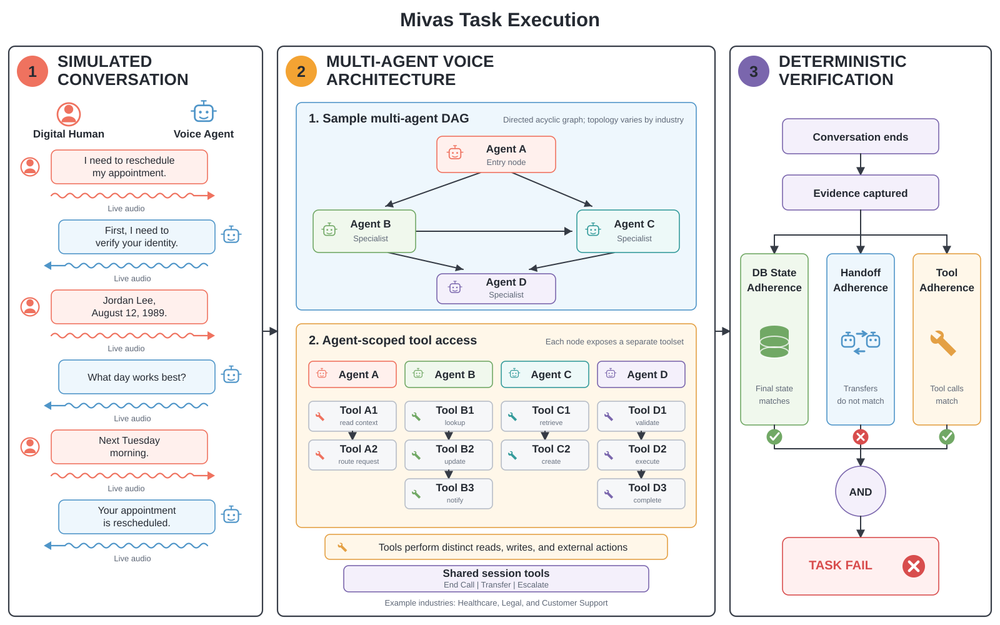

# MIVAS Bench: A Benchmark for Evaluating Voice AI Models in Multi-Agent Environments Across Industries



## Multi-Industry Voice Agent Simulation Bench

*Measuring how speech-to-speech (S2S) voice AI models perform inside the multi-agent architectures industries use to deploy voice AI today.*

[](#benchmark-methodology) [](#industries) [](#leaderboard) [](https://huggingface.co/datasets/bluejay-labs/mivas-bench) [](#demo)

MIVAS Bench evaluates speech-to-speech (S2S) models as they are deployed in real-world environments: inside stateful, multi-agent systems that conduct conversations, follow policy, use tools, preserve state, and route work across specialists. Cascaded speech-to-text, language-model, and text-to-speech systems serve as baselines.

Database state alone cannot establish reliability. Read-only scenarios may produce no state change, while others succeed through a session-level handoff. MIVAS therefore requires database-state adherence, handoff adherence, and tool adherence. Every applicable verifier must pass.

The benchmark is a technical reference for researchers, model labs, and engineers studying where S2S models succeed, where they fail, and which architectural or sector-specific demands require further progress.

MIVAS is an open-source, open-data, reproducible benchmark. This repository contains its industry environments, production-style prompts, multi-agent blueprints, provider harnesses, state systems, evaluation cases, verifiers, run artifacts, and setup prompt. MIVAS will continue to expand across the economic sectors adopting voice AI.

## Contents

- [Benchmark comparison](#benchmark-comparison)
- [Why MIVAS](#why-mivas)
- [What the benchmark measures](#what-the-benchmark-measures)
- [Benchmark methodology](#benchmark-methodology)
- [Industries](#industries)
- [Voice agent harnesses](#voice-agent-harnesses)
- [How MIVAS works](#how-mivas-works)
- [Evaluation and verification](#evaluation-and-verification)
- [Leaderboard](#leaderboard)
- [Dataset](#dataset)
- [Demo](#demo)
- [Quick start](#quick-start)
- [Deployment](#deployment)
- [Repository structure](#repository-structure)
- [Reproducibility](#reproducibility)
- [Current scope and limitations](#current-scope-and-limitations)
- [Contributing](#contributing)
- [Citation](#citation)


## Benchmark comparison

Voice benchmarks answer different questions. This comparison focuses narrowly on the capabilities needed to evaluate production-like, stateful, multi-agent voice-agent systems. It describes benchmark design and implemented repository support, not the breadth or maturity of published results.

| Benchmark | Live adaptive voice | Native S2S | Multi-industry tasks | Production-style multi-agent topology | Executed tools | Mutable isolated state | Deterministic final-state verification | Explicit handoff verification | Explicit tool-adherence verification | Repeated-run reliability | Coverage |
| --- | --- | --- | --- | --- | --- | --- | --- | --- | --- | --- | ---: |
| [MIVAS Bench](https://github.com/bluejay-ai-dev/mivas-bench) | Yes | Yes | Partial | Yes | Yes | Yes | Partial | Yes | Partial | Partial | 8.0/10 |
| [EVA](https://github.com/ServiceNow/eva) | Yes | Yes | Yes | No | Yes | Yes | Yes | No | Partial | Yes | 7.5/10 |
| [τ-Voice](https://arxiv.org/abs/2603.13686) | Yes | Yes | Yes | No | Yes | Yes | Yes | No | No | Partial | 6.5/10 |
| [VAmoS Bench](https://arxiv.org/abs/2607.27453) | Yes | Yes | No | No | Yes | Yes | No | No | Partial | Yes | 5.5/10 |
| [Full-Duplex-Bench v3](https://arxiv.org/abs/2604.04847) | No | Yes | Partial | No | Yes | No | No | No | Yes | No | 3.5/10 |
| [VoiceAgentBench](https://github.com/ola-krutrim/VoiceAgentBench) | No | No | Partial | No | No | No | No | No | Partial | No | 1.0/10 |

**Coverage scoring:** Yes = 1, Partial = 0.5, No = 0. `Partial` means that support is indirect, narrower than the dimension, or implemented with material gaps. Complete coverage means 10/10 across these selected production-system dimensions, not universal benchmark superiority.

MIVAS has the broadest combined coverage of this specific target: live native-S2S evaluation, industry workflows, specialist-agent topology, executed tools, isolated mutable state, and distinct state, handoff, and tool verifiers. It is not yet release-complete. Local task suites and strict verifier mappings do not cover every represented industry; missing state can be permissive in the core verifier; tool order is not enforced; and repeated runs are supported but neither mandatory nor published. Specialized benchmarks remain stronger in other areas: EVA in validated experience metrics and five-trial reporting, τ-Voice in controlled full-duplex acoustic simulation, VoiceAgentBench in multilingual spoken tool understanding, and Full-Duplex-Bench v3 in human-recorded disfluency tests.

Evidence: official sources for [MIVAS](https://github.com/bluejay-ai-dev/mivas-bench), [EVA](https://arxiv.org/abs/2605.13841), [τ-Voice](https://github.com/sierra-research/tau2-bench), [VAmoS](https://github.com/veris-ai/riley-agent), [Full-Duplex-Bench v3](https://github.com/DanielLin94144/Full-Duplex-Bench/tree/main/v3), and [VoiceAgentBench](https://arxiv.org/abs/2510.07978). VAmoS records real database-backed tool execution but grades assertions from traces rather than an explicit final-state query. Full-Duplex-Bench v3 executes deterministic mock tools against fixed human recordings, while VoiceAgentBench scores predicted textual tool calls without executing them.


## Why MIVAS

Most benchmarks isolate a model, prompt, audio sample, or pipeline component. Production voice systems instead divide responsibility among specialists, protect sensitive information, retrieve state, call tools, and transfer control during a live exchange. MIVAS treats this complete system as the unit of evaluation. To our knowledge, it is the first multi-industry voice benchmark built expressly around multi-agent production architectures.

> Can a voice agent complete real work across industries without violating the policies, boundaries, and procedural obligations that make the work trustworthy?

This design gives MIVAS two purposes:

1. **System comparison.** Compare S2S models on a common set of industry tasks, with cascaded voice systems serving as a reference baseline.
2. **Economic diagnosis.** Identify the sectors, workflows, and failure classes in which voice AI is ready for deployment, and those in which further improvement is necessary.


## What the benchmark measures

MIVAS evaluates complete spoken interactions across several related dimensions.


| Dimension              | Question                                                                                       |
| ---------------------- | ---------------------------------------------------------------------------------------------- |
| Task completion        | Did the system achieve the caller's legitimate objective?                                      |
| Tool use               | Did it call the correct tools with valid arguments and in the required order?                  |
| State accuracy         | Did the final database state reflect what the conversation authorized?                         |
| Policy adherence       | Did it observe identity, disclosure, safety, privacy, and domain-specific rules?               |
| Handoff integrity      | Did it transfer to the correct specialist without losing context or repeating the interaction? |
| Refusal and escalation | Did it decline unsafe or unauthorized requests and escalate when required?                     |
| Conversational quality | Was the exchange intelligible, responsive, appropriately paced, and complete?                  |
| Reliability            | Does the system succeed consistently across repeated runs of the same case?                    |
| Cost and latency       | What resources and response times were required to produce the result?                         |


The primary local verifier computes task correctness as:

```text
database-state adherence AND handoff adherence AND tool adherence
```

**Database-state adherence** compares final state with the expected outcome. **Handoff adherence** checks provider-native transfers, which require neither an industry API call nor a database mutation. **Tool adherence** checks industry tools, including read-only calls that final state cannot reveal. Transcript, audio, latency, quality, and cost provide diagnostic context but do not replace these verifiers.

## Benchmark methodology


### Industries follow adoption

MIVAS selects sectors where telephone interactions remain economically important and voice automation is advancing quickly. Initial coverage includes healthcare, legal services, financial services, customer support, and travel.

Each industry models a hypothetical company with fictional names and records. Its workflows draw on:

- production voice architectures and deployment experience;
- industry operations, policy, and regulation;
- public examples of work delegated to voice agents.

### Production-style multi-agent systems

Each industry is a network of specialists. Reception classifies requests, identity establishes authorization, and domain agents perform the work. Handoffs are scored behavior, not hidden implementation detail. Prompts resemble production prompts and are not shortened for a particular model.

### Deterministic, stateful environments

Each case begins from known SQLite state. Industry tools access it through FastAPI, and every call receives an isolated database. Evaluation compares:

1. the initial state;
2. the transcript and tool sequence;
3. the final state after the conversation.

Consequential actions must exist in final state. Merely saying that an appointment was booked earns no credit.

### Composable runtimes

MIVAS separates the voice system from the environment. A **harness** adapts a model or platform to the benchmark contract. An **industry pack** supplies agents, prompts, tools, policies, fixtures, and cases.

Any compatible harness can be paired with any compatible industry:

```text
voice agent harness + industry pack = benchmark runtime
```

This separation compares providers without rewriting tasks and industries without rebuilding the voice stack.

## Industries


| Industry                                         | Hypothetical organization | Principal challenge                                                            |
| ------------------------------------------------ | ------------------------- | ------------------------------------------------------------------------------ |
| [Control](industries/control-industry/)          | Bluejay's Repair Services | Minimal end-to-end wiring and appointment state                                |
| [Healthcare](industries/healthcare/)             | Straus Dermatology        | Identity, scheduling, coverage, billing, and bounded clinical support          |
| [Legal](industries/legal/)                       | Halverson & Reed          | Conflict screening, intake discipline, legal-advice boundaries, and scheduling |
| [Finance](industries/finance/)                   | Copperline Credit Union   | Identity, money movement, fee policy, cards, and regulated disputes            |
| [Customer support](industries/customer-support/) | Kestrel Electronics       | Orders, returns, service, membership, fraud, and product safety                |
| [Travel](industries/travel/)                     | Juniper Airlines          | Disruptions, fare rules, ancillary pricing, identity, and payment              |


The control industry verifies that a harness can receive a call, hand off, invoke a tool, and write expected state. New harnesses should pass it before entering a scored industry.

An industry pack includes:

- an `agent_blueprint.json` describing agents, tools, and handoffs;
- production-style system prompts for every agent;
- agent-facing schemas in `tools.json`;
- deterministic schema and seed data in `db/`;
- a FastAPI state and tool service in `tool_server.py`;
- an `agent_blueprint.mmd` graph of the handoff topology.

Scored industries also include cases, Digital Humans, expected final state, and verification artifacts.

## Voice agent harnesses

Harnesses translate the MIVAS blueprint into provider-specific runtimes. Native S2S models are the primary systems under evaluation; cascaded systems provide baselines.

Current harness families include:


| Category                   | Harness families                                                                                                                                                                                                                              |
| -------------------------- | --------------------------------------------------------------------------------------------------------------------------------------------------------------------------------------------------------------------------------------------- |
| Realtime model APIs        | [OpenAI](voice-agent-harnesses/openai/), [Gemini](voice-agent-harnesses/gemini/), [xAI](voice-agent-harnesses/grok/), [Amazon Nova](voice-agent-harnesses/aws/), [Qwen](voice-agent-harnesses/qwen/), [NVIDIA](voice-agent-harnesses/nvidia/) |
| Voice model and agent APIs | [AssemblyAI](voice-agent-harnesses/assemblyai/), [Deepgram](voice-agent-harnesses/deepgram/), [ElevenLabs](voice-agent-harnesses/elevenlabs/)                                                                                                 |
| Voice platforms            | [Vapi](voice-agent-harnesses/vapi/), [Retell](voice-agent-harnesses/retell/), [Bland](voice-agent-harnesses/bland/), [Cartesia](voice-agent-harnesses/cartesia/), [Twilio](voice-agent-harnesses/twilio/)                                     |
| Orchestration frameworks   | [LiveKit](voice-agent-harnesses/livekit/), [Pipecat](voice-agent-harnesses/pipecat/)                                                                                                                                                          |


Support varies by runtime and industry. A listed family has an implemented runtime, but not every model or deployment mode has completed every suite.

See the [harness contract](voice-agent-harnesses/README.md) for dispatch, handoff, session, state, and tracing requirements.

## How MIVAS works

1. Select a harness from `voice-agent-harnesses/`.
2. Select an industry from `industries/`.
3. The blueprint assembles prompts, tools, and handoffs.
4. A Digital Human calls the composed runtime.
5. Per-call tools operate against isolated state.
6. Verification scores the transcript, tool and handoff traces, and final state.
7. Repeated runs produce reliability, latency, cost, and task-level results.

One container packages the harness, industry, database, and state service.

## Evaluation and verification

Digital Humans have defined identities, goals, constraints, and failure conditions. Cases cover ordinary and multi-step work, policy boundaries, refusals, escalation, ambiguity, and adversarial pressure.

Evaluation draws on several forms of evidence:

- **Transcript:** disclosures, explanations, refusals, and unsupported claims.
- **Tools:** calls, arguments, order, and returned values.
- **Handoffs:** routing between specialists.
- **State:** durable changes such as bookings, claims, and payments.
- **Audio and traces:** latency, interruptions, token use, and cost.

The exporter writes one conversation per CSV row and preserves repeated trials separately. Each record includes task identity, component passes, state differences, metrics, transcript data, latency, and estimated cost. Task correctness comes from the MIVAS verifier, not Bluejay's general goal judge.

Bluejay executes simulations and returns evaluation data. This repository includes runtime composition, deployment, verification, and export; a public standalone invocation is not yet defined.

## Leaderboard

The MIVAS leaderboard will report S2S performance by industry, task class, and verifier component, with cascaded systems presented as baselines. Every published result should identify the benchmark release, model and provider version, harness revision, trial count, and evaluation configuration.

## Dataset

The public MIVAS dataset will be released on Hugging Face with versioned industry cases, caller specifications, expected tool and handoff paths, expected final state, and the metadata required to reproduce each evaluation.

## Demo

The MIVAS demo will present representative calls with synchronized audio, transcripts, handoffs, tool calls, verifier outcomes, and final-state differences.

## Quick start


### Requirements

- Python 3.12 or later
- [uv](https://docs.astral.sh/uv/)
- a provider API key for the selected harness
- microphone and speaker access for local voice testing


### Install

```bash
git clone https://github.com/bluejay-ai-dev/mivas-bench.git
cd mivas-bench
uv sync
cp .env.example .env
```

Set a harness, industry, and the credentials required by that harness:

```dotenv
HARNESS=openai/realtime-2.1
INDUSTRY=control-industry
OPENAI_API_KEY=
```


### Validate the composition

```bash
uv run python run.py --check
```

This validates blueprint composition, not an official benchmark run.

### Speak to the agent

```bash
uv run python tests/converse.py
```

Begin with `control-industry`, ask to schedule a repair, and confirm the handoff and appointment state.

To run the selected tool server and agent directly:

```bash
uv run python run.py
```

See [tests/README.md](tests/README.md) for the text fallback and additional local checks.

## Deployment

Each harness and industry pair becomes a Kubernetes Deployment and Service:

```bash
uv run python run.py --build --apply --no-logs
```

For several pairs:

```dotenv
AGENTS=openai/realtime-2.1:healthcare,nvidia/nemotron:control-industry
```

```bash
uv run python run.py --codebuild --apply --no-logs
```

With `MIVAS_BASE_DOMAIN`, each pair receives:

```text
{harness-industry-slug}.{MIVAS_BASE_DOMAIN}
```

`X-Mivas-Call-Id` isolates each call. At hangup, the runtime can persist final state and SQLite data for evaluation.

Operational details, provider exceptions, ingress settings, and concurrency constraints are documented in the root `.env.example`, the [industry contract](industries/README.md), and the [harness contract](voice-agent-harnesses/README.md).

## Repository structure

```text
mivas-bench/
├── industries/                 # Environments, prompts, tools, tasks, and state
├── voice-agent-harnesses/      # Provider and framework adapters
├── runtime/                    # Shared database, call identity, and snapshot code
├── expected-final-state/       # Versioned expected state used by verification
├── scripts/                    # Verification, export, costing, and data utilities
├── tests/                      # Runtime, contract, and integration tests
├── k8s/                        # Kubernetes resources
├── codebuild/                  # Container build and registry automation
├── run.py                      # Local composition, build, and deployment entry point
├── .env.example                # Harness, industry, provider, and deployment settings
└── pyproject.toml              # Python project and dependency configuration
```

Generated exports are written to `eval_outputs/`. Begin with an industry or harness README for component-specific details.

## Reproducibility

MIVAS makes each score traceable:

- companies and records are fictional;
- schemas, seed data, prompts, tools, and handoff graphs are versioned;
- each call receives isolated state;
- consequential actions are checked against final state;
- repeated trials remain separate;
- exports preserve task, transcript, trace, latency, metric, and cost evidence.

Comparisons should identify the repository revision, harness, industry suite, model and provider versions, trial count, concurrency, call limit, evaluator, and any retries or exclusions.

## Current scope and limitations

- Not every harness has completed every industry.
- Provider telemetry varies, and managed platforms may impose behavior the harness cannot control.
- Simulated callers improve scale and reproducibility, but they do not reproduce every property of human speech or behavior.
- The benchmark models hypothetical organizations and bounded workflows, not the full operational surface of an industry.
- Aggregate rankings should be versioned. Scores from different task, prompt, verifier, or runtime revisions should not be compared without qualification.

## Contributing

Contributions may add harnesses, industries, policy cases, deterministic checks, measurements, or benchmark corrections.

New harnesses should first pass the control industry. New industry cases should state the initial fixture, caller goal, required conduct, prohibited conduct, expected tools, expected final state, and the evidence used for scoring.

## Citation

If you use MIVAS Bench in published work, cite the repository and the benchmark release used for the evaluation.

```bibtex
@misc{siddiqi2026mivasbench,
      title={MIVAS Bench: Multi-Industry Voice Agent Simulation Bench},
      author={Faraz Siddiqi and Yash Savalia},
      year={2026},
      url={https://github.com/bluejay-ai-dev/mivas-bench},
}
```
