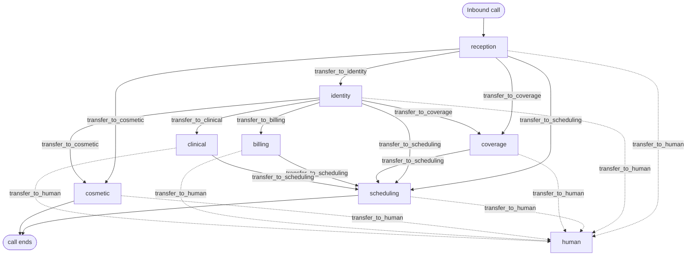
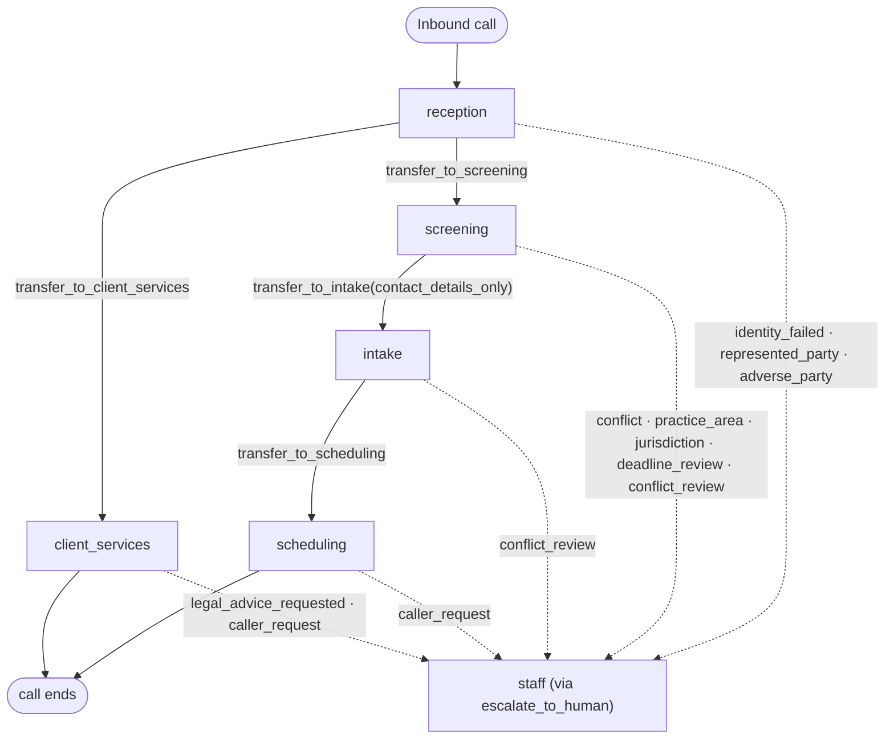
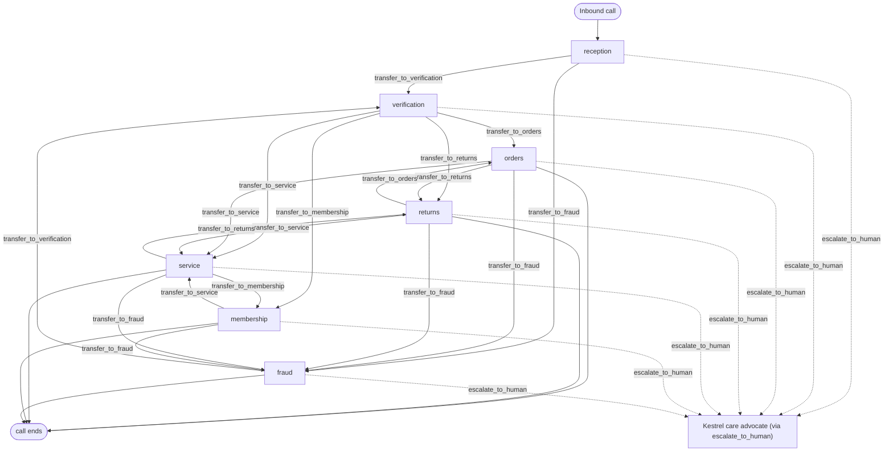

# MIVAS Bench: A Benchmark for Evaluating Voice AI Models in Multi-Agent Environments Across Industries

<p align="center">
  
</p>

## Multi-Industry Voice Agent Simulation Bench

*Measuring speech-to-speech (S2S) voice AI models in production-style multi-agent systems.*

[](https://research.getbluejay.ai/benchmarks/mivas/leaderboard) [](https://research.getbluejay.ai/benchmarks/mivas/methodology) [](https://huggingface.co/datasets/bluejay-labs/mivas-bench) [](https://research.getbluejay.ai/benchmarks/mivas/industries)

MIVAS Bench is an indicator of speech-to-speech (S2S) voice AI performance across economic sectors. It evaluates models through high-specificity tasks and deterministic verifiers that produce granular, component-level evaluation rewards in production-style, multi-agent voice environments for healthcare, legal services, and customer support. Each task places a provider harness inside an industry-specific agent DAG with production-length prompts, provider-native handoffs, tool access, and isolated state. Tool use, handoff path, and final database state are scored conjunctively: Pass@1 measures single-run capability, while Pass<sup>5</sup> measures whether that capability survives five independent trials. Native S2S models are the primary systems under evaluation; cascaded speech-to-text, language-model, and text-to-speech systems serve as baselines.

## Benchmark comparison

| Benchmark            | **Multi-agent topology** | **Handoff verification** | **Conjunctive verification** | Live adaptive voice | Native S2S | Multi-industry coverage | Stateful tool execution | Deterministic final-state verifier | Tool-adherence verification | Repeated-run reliability support |
| -------------------- | :----------------------: | :----------------------: | :--------------------------: | :-----------------: | :--------: | :---------------------: | :---------------------: | :--------------------------------: | :-------------------------: | :------------------------------: |
| MIVAS Bench          | <div align="center"></div> | <div align="center"></div> | <div align="center"></div> | <div align="center"></div> | <div align="center"></div> | <div align="center"></div> | <div align="center"></div> | <div align="center"></div> | <div align="center"></div> | <div align="center"></div> |
| EVA                  | <div align="center"></div> | <div align="center"></div> | <div align="center"></div> | <div align="center"></div> | <div align="center"></div> | <div align="center"></div> | <div align="center"></div> | <div align="center"></div> | <div align="center"></div> | <div align="center"></div> |
| τ-Voice              | <div align="center"></div> | <div align="center"></div> | <div align="center"></div> | <div align="center"></div> | <div align="center"></div> | <div align="center"></div> | <div align="center"></div> | <div align="center"></div> | <div align="center"></div> | <div align="center"></div> |
| VAmoS Bench          | <div align="center"></div> | <div align="center"></div> | <div align="center"></div> | <div align="center"></div> | <div align="center"></div> | <div align="center"></div> | <div align="center"></div> | <div align="center"></div> | <div align="center"></div> | <div align="center"></div> |
| Full-Duplex-Bench v3 | <div align="center"></div> | <div align="center"></div> | <div align="center"></div> | <div align="center"></div> | <div align="center"></div> | <div align="center"></div> | <div align="center"></div> | <div align="center"></div> | <div align="center"></div> | <div align="center"></div> |
| VoiceAgentBench      | <div align="center"></div> | <div align="center"></div> | <div align="center"></div> | <div align="center"></div> | <div align="center"></div> | <div align="center"></div> | <div align="center"></div> | <div align="center"></div> | <div align="center"></div> | <div align="center"></div> |

**Legend:**  Yes ·  Partial ·  No

## Methodology

### Multi-agent industry environments

MIVAS represents each industry as a directed graph of specialist agents, following the architecture patterns used by companies deploying voice AI in production. Each agent has a bounded operational role and the prompt, tools, policies, and context required to resolve the customer intents within that role. An agent can complete the work itself, hand the caller forward to the next stage of a workflow, or transfer the caller to a specialist better suited to the request.

Handoffs are first-class benchmark behavior. They determine whether the system selected the correct specialist, observed authorization and workflow gates, and preserved the intended route through a long, multi-step interaction. The prompts are production-length operating specifications rather than shortened benchmark instructions.

### Harness and industry composition

The repository separates model execution from industry behavior:

```text
voice agent harness + industry pack = benchmark runtime
```

- A **voice agent harness** contains the provider-specific runtime architecture. It connects the model to the Digital Human, carries bidirectional audio, instantiates the agents declared by the blueprint, performs provider-native handoffs and session operations, and dispatches industry tool calls.
- An **industry pack** contains the multi-agent blueprint, production-style system prompts, tool definitions, database schema and seed state, per-call state service, and scored task suite.

The industry's `agent_blueprint.json` is the interface between the two. Pairing a harness with an industry instantiates one voice agent system, which makes it possible to evaluate the same model runtime across industries or the same industry against multiple model providers without coupling either side to the other.

Bluejay Digital Humans conduct live, adaptive voice calls against the composed runtime. Each simulation result identifier becomes the call identifier used by every tool request, giving the conversation an isolated SQLite database initialized from the industry's schema and seed data. At hangup, MIVAS preserves the transcript, execution trace, final state, and database snapshot used for verification.

### Task suites

Each scored industry contains 72 locked cases: 60 base tasks and 12 audio-condition variants that repeat selected cases under background noise or degraded signal. The suites are balanced across easy, medium, and hard tasks. Every case begins from known state and defines:

- the caller's identity, objective, traits, and behavioral constraints;
- scripted facts or responses needed to keep the task well-specified;
- the expected specialist handoff path;
- required tool calls and constrained arguments;
- the exact final database state produced by a correct interaction.

The released tasks were written, reviewed, and manually exercised by humans, then checked through contract tests and deterministic replay against fresh seeded state. Constrained simulator responses reduce avoidable variance while preserving live voice interaction.

Five categories in each suite cover the industry's principal operational workflows. A sixth `R` category tests the boundaries around regulation, policy, refusal, escalation, impersonation, and adversarial requests. The identifiers reflect the underlying task data: Healthcare and Legal use `C1` through `C5` plus `R`, while Customer Support uses `T1` through `T5` plus `R`. The precise `R` label is industry-specific rather than uniform:

| Industry | Domain categories | `R` category |
| -------- | ----------------- | ------------ |
| Healthcare | New-patient access, appointment management, coverage and benefits, cosmetic concierge, billing and payments | Regulatory adherence |
| Legal | Reception and routing, conflicts and barred matters, eligibility gates, intake and documents, fees and booking | Clients and refusals |
| Customer Support | Orders and delivery, returns and refunds, service, membership, price matching | Regulatory adherence |

### Conjunctive deterministic verification

Task correctness is conjunctive:

```text
tool adherence AND handoff adherence AND database-state adherence
```

- **Tool adherence** verifies that required industry calls occurred with the constrained arguments defined by the task. This captures reads and other consequential calls that final state alone cannot reveal.
- **Handoff adherence** verifies that the expected provider-native transfers occurred in order. A handoff is a session-level operation, not an external API call, and may leave no database mutation.
- **Database-state adherence** compares the persisted state at hangup with the expected state produced from the same seed data and authorized tool sequence.

All three applicable verifiers must pass. A successful database write cannot conceal an incorrect route, and a correct handoff cannot conceal a missing tool call. This separation also produces component-level feedback for multi-step tasks, exposing whether a failure arose from action selection, agent routing, or state mutation rather than collapsing the interaction into a single opaque judgment.

The verifier matches expected tools by name and constrained arguments, checks the expected handoffs as an ordered path, and compares final state over the industry's write-bearing tables. Transcript quality, audio behavior, latency, and cost remain diagnostic evidence. They do not substitute for deterministic task correctness.

### Pass@1 and Pass<sup>5</sup>

Pass@1 records whether one conversation satisfies the full conjunctive criterion. Pass<sup>5</sup> is stricter: a task receives a Pass<sup>5</sup> only when all five independent conversations pass. Repetition distinguishes a system that can complete a task from one that can do so reliably.

The released evaluation matrix contains five conversations per case for eight completed runtimes across all three scored industries. Exports retain one row per conversation, including task identity, component passes, state differences, transcript and trace data, latency, metrics, and estimated cost. This preserves run-level failures and allows Pass@1, Pass<sup>5</sup>, and component scores to be recomputed from the underlying evidence.

## Industries


| Industry                                         | Sample company            | Principal challenge                                                            |
| ------------------------------------------------ | ------------------------- | ------------------------------------------------------------------------------ |
| [Healthcare](industries/healthcare/)             | Straus Dermatology        | Identity, scheduling, coverage, billing, and bounded clinical support          |
| [Legal](industries/legal/)                       | Halverson & Reed          | Conflict screening, intake discipline, legal-advice boundaries, and scheduling |
| [Customer support](industries/customer-support/) | Kestrel Electronics       | Orders, returns, service, membership, fraud, and product safety                |


The initial release concentrates on Healthcare, Legal, and Customer Support, sectors where voice AI is already being deployed across complex, consequential workflows. The sample companies make the environments reproducible while retaining the authorization gates, policies, specialist boundaries, tools, and state transitions that shape production systems.

Each industry pack includes an agent blueprint, production-style prompts, tool schemas, deterministic seed data, a FastAPI state service, a handoff graph, Digital Human cases, expected outcomes, and verification artifacts.

## Industry architectures

Each initial-release scored industry uses specialist agents. Arrows below are permitted handoffs declared in the current industry blueprint.

<details open>
<summary><strong>Healthcare: Straus Dermatology</strong></summary>

Straus Dermatology routes callers through public reception, identity-gated patient work, and focused scheduling, coverage, cosmetic, billing, and clinical specialists.

- `reception`: answers public office questions and routes the initial request.
- `identity`: identifies and verifies patients before protected chart work.
- `scheduling`: classifies visits and books, changes, cancels, or waitlists appointments.
- `coverage`: checks plan acceptance and eligibility, and captures insurance updates.
- `cosmetic`: quotes approved services and books cosmetic consultations.
- `billing`: handles balances, charges, payment links, financing, and fee-waiver requests.
- `clinical`: handles results status, refill requests, nurse messages, and portal activation.



</details>

<details open>
<summary><strong>Legal: Halverson &amp; Reed</strong></summary>

Halverson & Reed separates caller routing, ordered conflict and eligibility screening, intake, evaluation scheduling, and service for existing clients.

- `reception`: identifies callers, classifies requests, takes messages, and routes eligible calls.
- `screening`: checks conflicts, practice area, jurisdiction, and filing deadlines in order.
- `intake`: records the matter and sends intake and records-authorization documents.
- `scheduling`: discloses tool-provided fees and manages evaluation bookings and cancellations.
- `client_services`: provides status on firm matters and records messages or notes.



</details>

<details open>
<summary><strong>Customer Support: Kestrel Electronics</strong></summary>

Kestrel Electronics places order-bound work behind verification while allowing reception to route suspected impersonation directly to a separate fraud specialist.

- `reception`: answers public store, policy, fee, and knowledge-base questions and routes calls.
- `verification`: identifies customers and verifies order ZIP and card last four.
- `orders`: handles order status, delivery changes, cancellations, and price matches.
- `returns`: checks eligibility and fees, starts returns, creates labels, and tracks refunds.
- `service`: checks coverage and manages TechCrew service appointments and safety refusals.
- `membership`: handles membership status, upgrades, and cancellations.
- `fraud`: checks suspicious charges and contacts, files scam reports, and gives urgent guidance.



</details>

## Voice agent harnesses

Harnesses translate the MIVAS blueprint into provider-specific runtimes. Native S2S models are the primary systems under evaluation; cascaded systems provide baselines.

| Status | Runtime |
| ------ | ------- |
| Native S2S | [OpenAI Realtime 2.1 and 2.1 Mini](voice-agent-harnesses/openai/), [Gemini Flash Live 3.1 and 2.5 Flash Native Audio](voice-agent-harnesses/gemini/), [Amazon Nova Sonic 2](voice-agent-harnesses/aws/), [Grok Voice](voice-agent-harnesses/grok/), [Qwen Audio Realtime](voice-agent-harnesses/qwen/) |
| Cascaded baseline | [LiveKit Cascaded](voice-agent-harnesses/livekit/) with Deepgram Flux, GPT-4.1, and ElevenLabs |

The completed runtimes above account for the eight-runtime Pass<sup>5</sup> matrix. See the [harness contract](voice-agent-harnesses/README.md) for the provider adapter, tool dispatch, handoff, and session requirements.

## Quick start

### Requirements

- Python 3.12 or later
- [uv](https://docs.astral.sh/uv/)
- a provider API key for the selected harness
- microphone and speaker access for local voice testing


### Install

```bash
git clone https://github.com/bluejay-ai-dev/mivas-bench.git
cd mivas-bench
uv sync
cp .env.example .env
```

Set a harness, industry, and the credentials required by that harness:

```dotenv
HARNESS=openai/realtime-2.1
INDUSTRY=control-industry
OPENAI_API_KEY=
```

### Validate with `control-industry`

`control-industry` is a minimal receptionist-to-scheduler smoke environment with no scored task suite. It exists to confirm that a harness can receive a call, construct the declared agents, complete a provider-native handoff, invoke an industry tool, and persist appointment state. It is a setup fixture and is excluded from MIVAS industry results.

```bash
uv run python run.py --check
```

This checks blueprint composition. It does not place a call or produce an official benchmark result.

### Speak to the agent

```bash
uv run python tests/converse.py
```

Ask to schedule a repair, then confirm the scheduler handoff and resulting appointment state.

To run the selected tool server and agent directly:

```bash
uv run python run.py
```

See [tests/README.md](tests/README.md) for the text fallback and additional local checks.

## Deployment

Each harness and industry pair becomes a Kubernetes Deployment and Service:

```bash
uv run python run.py --build --apply --no-logs
```

For several pairs:

```dotenv
AGENTS=openai/realtime-2.1:healthcare,nvidia/nemotron:control-industry
```

```bash
uv run python run.py --codebuild --apply --no-logs
```

With `MIVAS_BASE_DOMAIN`, each pair receives:

```text
{harness-industry-slug}.{MIVAS_BASE_DOMAIN}
```

`X-Mivas-Call-Id` isolates each call. At hangup, the runtime can persist final state and SQLite data for evaluation.

Operational details, provider exceptions, ingress settings, and concurrency constraints are documented in the root `.env.example`, the [industry contract](industries/README.md), and the [harness contract](voice-agent-harnesses/README.md).

Industry packs live in `industries/`, provider adapters in `voice-agent-harnesses/`, shared state code in `runtime/`, verification utilities in `scripts/`, and generated exports in `eval_outputs/`.

## Reproducibility

MIVAS makes each score traceable:

- companies and records are fictional;
- schemas, seed data, prompts, tools, and handoff graphs are versioned;
- each call receives isolated state;
- consequential actions are checked against final state;
- repeated trials remain separate;
- exports preserve task, transcript, trace, latency, metric, and cost evidence.

Comparisons should identify the repository revision, harness, industry suite, model and provider versions, trial count, concurrency, call limit, evaluator, and any retries or exclusions.

## Limitations

Not every implemented harness has completed every industry, and provider telemetry varies. Simulated callers and sample companies support reproducibility but do not represent every property of human speech or a sector's full operational surface. Component scores are evaluation outputs, not an RL training interface. Do not compare scores across task, prompt, verifier, or runtime revisions without qualification.

## Contributing

Contributions may add harnesses, industries, policy cases, deterministic checks, measurements, or benchmark corrections.

New harnesses should first pass the control industry. New industry cases should state the initial fixture, caller goal, required conduct, prohibited conduct, expected tools, expected final state, and the evidence used for scoring.

## Citation

If you use MIVAS Bench in published work, cite the repository and the benchmark release used for the evaluation.

```bibtex
@misc{siddiqi2026mivasbench,
      title={MIVAS Bench: Multi-Industry Voice Agent Simulation Bench},
      author={Faraz Siddiqi and Yash Savalia},
      year={2026},
      url={https://github.com/bluejay-ai-dev/mivas-bench},
}
```


## License

The [MIT License](LICENSE) applies only to the code, data, and other materials
explicitly included in this repository. It does not grant rights to externally
hosted datasets or artifacts.
