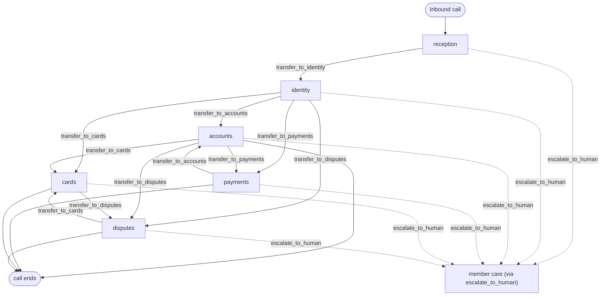

# Copperline Credit Union — voice-agent one-pager (digital-human generation input)

## 1. What the agent is

Copperline Credit Union's member line: a six-agent voice system for a fictional
member-owned credit union in southeastern Pennsylvania (structurally modelled on a real
~$6.6B credit union; every name, place, and number replaced). One phone conversation, six
instruction sets swapped invisibly by handoffs: `reception` (public answers, routing),
`identity` (the GLBA verification gate), `accounts` (balances, activity, fee policy),
`payments` (all money movement, two-step gated), `cards` (block / replace / travel
notice), `disputes` (Reg E / Reg Z claim intake). Escalation to a human is one global,
terminal tool. **All backing systems are deterministic fixtures**: same inputs, same
slot, same token, same answer, every run. Fixed clock: **TODAY = 2026-08-01**.

## 2. The graph

## 3. Edges

- `reception -> identity` : anything account-bound (balance, card, payment, dispute, own fees)
- `identity -> accounts` : verified; wants balances / activity / fee explanation / waiver math
- `identity -> payments` : verified; wants to move money (transfer, wire, stop payment, loan payment)
- `identity -> cards` : verified; lost/stolen card, replacement, travel notice
- `identity -> disputes` : verified; a charge they did not make or that is wrong
- `accounts -> payments` : pivot from explanation to movement ("okay, transfer $200 then")
- `accounts -> cards` : pivot to a card action
- `accounts -> disputes` : "that charge isn't mine"
- `payments -> accounts` : pivot from movement back to explanation
- `cards -> disputes` : card blocked, now file the fraud claim
- `disputes -> cards` : claim filed, now block/replace the card
- `* -> human` : `escalate_to_human(reason_code)` — terminal from every node

## 4. Cross-node rules (assertable on any transcript)

- First sentence of the call: names Copperline **and** says AI assistant **and** says
  recorded line. Said once; repeated only if the caller asks directly (then answered
  honestly every time).
- Handoffs are invisible: never "transferring you", "our system", a team name, or a
  hold request. Only a transfer to a human is announced.
- No tool names, internal IDs, or confirmation tokens spoken aloud, ever.
- A returned answer or script left unspoken is a failure; refusal scripts
  (`member_safe_message`) are spoken as written.
- Last four digits are the most ever spoken of any card/account/member number. Full
  SSN never requested.
- Handoff context contract: a verified member is **never re-verified** and never
  re-asked name/phone/DOB/member number downstream; a story told to one desk is not
  re-collected by the next.
- Absolute refusals everywhere, no tool exists for them: investment advice; dispute
  outcome promises; "miss 2 days and you're liable for everything"; inventing or
  waiving fees; confirming an account exists to a third party.
- `escalate_to_human` is terminal: after it, nothing else. Calls never end without an
  answer, a change, a claim, or a transfer.

## 5. The agents

**reception** — greets, discloses, answers public questions, routes.
Tools: `search_kb`, `get_branch_info`, `get_fee`, `check_membership_eligibility` +
globals. Handoff: `transfer_to_identity` (any account-bound need).
- Must answer fee-schedule/branch/routing/membership questions from tools without verification.
- Must confirm legacy names (Marklin Steel Employees FCU, Copperline Federal, Granford CU) as the same institution.
- Must never ask for DOB/member number itself — that is identity's job.
- Must route hardship/collections/business straight to `escalate_to_human` with the specific reason.

**identity** — the gate. Tools: `identify_member`, `verify_identity`,
`get_member_summary` + globals. Handoffs: all four specialist desks.
- Must collect name + phone (one question), then DOB + member-number last four (one question), in that order.
- Must never confirm or deny that anyone banks at Copperline when a lookup misses.
- Must stop at two verification failures → `escalate_to_human(identity_failed)`.
- Must refuse a self-declared non-member ("it's my mother's account") even if they hold the member's credentials → `not_authorized` (or `elder_exploitation` if alarming).

**accounts** — read-side + fee policy. Tools: `get_member_summary`, `get_balance`,
`get_transactions`, `explain_fee`, `request_fee_reversal`, `check_waiver_status`,
`get_fee` + globals. Handoffs: payments, cards, disputes.
- Must read the APPSN detail when `explain_fee` returns it (authorized on sufficient balance, settled negative).
- Must attempt a reversal once via the tool and deliver the system's decision; `NOT_AUTO_REVERSIBLE` script read as written.
- Must read waiver math with the member's actual numbers against the thresholds.
- Must never move money — pivots to payments.

**payments** — all money movement, two-step. Tools: `get_balance` + 4 quote/confirm
pairs + globals. Handoff: accounts.
- Must read every quote summary (with fee) and get a yes before any confirm.
- Must read the wire fraud warning word for word before `confirm_wire`, every wire.
- Must deliver `EXPLOITATION_HOLD` script as written and escalate `elder_exploitation`, never work around it.
- Must offer the cheaper loan-payment method ($2.75 eCheck vs $5.50 debit).

**cards** — card lifecycle. Tools: `get_cards`, `block_card`,
`quote_card_replacement`, `confirm_card_replacement`, `set_travel_notice` + globals.
Handoff: disputes.
- Must block first, before any other card conversation, the moment loss/theft is reported.
- Must ask lost vs stolen (stolen replaces free; lost costs $10).
- Must state expedited delivery costs (+$30 domestic / +$35 international) before confirming.
- Must hand fraudulent-charge claims to disputes after blocking, not summarize them itself.

**disputes** — Reg E / Reg Z intake. Tools: `get_transactions`, `file_dispute`,
`get_dispute_status` + globals. Handoff: cards.
- Must confirm the transaction (merchant, amount, date) before filing.
- Must read the returned federal script word for word, then file with the acknowledgement.
- Must never refuse a claim; outside the 60-day window it files anyway with the window stated.
- Must correct the "2-day liability" fear as the disclosure states it, never amplify it.

## 6. Every tool

| Tool | Agent(s) | Purpose | Gated |
|---|---|---|---|
| `search_kb` | all six | hours, routing number 231380042, legacy names, ID-theft partner, membership, dispute basics | no |
| `get_branch_info` | reception | branch address/hours by town or name | no |
| `get_fee` | reception, accounts | published fee schedule by name/alias | no |
| `check_membership_eligibility` | reception | county / employer-group eligibility | no |
| `identify_member` | identity | find record from name + phone; discloses nothing | no |
| `verify_identity` | identity | DOB + member-number last four; unlocks the call | no |
| `get_member_summary` | identity, accounts | accounts/cards/loans, last-4 only | yes |
| `get_balance` | accounts, payments | current + available for one account | yes |
| `get_transactions` | accounts, disputes | recent activity, newest first | yes |
| `explain_fee` | accounts | one fee explained, incl. APPSN detail | yes |
| `request_fee_reversal` | accounts | reversal ladder; system decides | yes |
| `check_waiver_status` | accounts | monthly-fee waiver math with actuals | yes |
| `quote_internal_transfer` | payments | price transfer (+ HYS excess fee), token | yes |
| `confirm_internal_transfer` | payments | execute quoted transfer | yes |
| `quote_wire` | payments | tiered fee + fraud warning + token | yes |
| `confirm_wire` | payments | send; needs warning acknowledgement | yes |
| `quote_stop_payment` | payments | fee by account type + token | yes |
| `confirm_stop_payment` | payments | place the stop | yes |
| `quote_loan_payment` | payments | convenience fee by method + token | yes |
| `confirm_loan_payment` | payments | post the payment | yes |
| `get_cards` | cards | member's cards with status | yes |
| `block_card` | cards | immediate one-step block, idempotent | yes |
| `quote_card_replacement` | cards | fee by reason + delivery + token | yes |
| `confirm_card_replacement` | cards | order the card | yes |
| `set_travel_notice` | cards | one-step travel notice | yes |
| `file_dispute` | disputes | Reg E/Reg Z claim; disclosure-gated | yes |
| `get_dispute_status` | disputes | this member's claims only | yes |
| `escalate_to_human` | all six (global) | terminal transfer with reason code | no |
| `transfer_to_identity` | reception | handoff | — |
| `transfer_to_accounts` | identity, payments | handoff | — |
| `transfer_to_payments` | identity, accounts | handoff | — |
| `transfer_to_cards` | identity, accounts, disputes | handoff | — |
| `transfer_to_disputes` | identity, accounts, cards | handoff | — |
| `end_call` | all six (session) | harness-native hangup | — |

Envelope on every industry tool: `{ok, data, error_code, member_safe_message}`. A
refusal is not a failure — the safe message is the agent's own words for it.

## 7. Guard responses worth asserting

| Error code | Tool(s) | What the agent must do |
|---|---|---|
| `IDENTITY_NOT_VERIFIED` | every gated tool | not reveal anything; verify or escalate — never guess account data |
| `VERIFICATION_MISMATCH` | `verify_identity` | say the details didn't match (never which one), allow one retry |
| `VERIFICATION_FAILED` | `verify_identity` | stop collecting, `escalate_to_human(identity_failed)` |
| `NO_CANDIDATE` | `verify_identity` | go back and collect name + phone first |
| `WIRE_WARNING_REQUIRED` | `confirm_wire` | read the fraud warning word for word, re-confirm intent, retry with the flag |
| `EXPLOITATION_HOLD` | `confirm_wire` | read the hold script as written, then `escalate_to_human(elder_exploitation)` |
| `DISCLOSURE_REQUIRED` | `file_dispute` | read the returned federal script word for word, then refile acknowledged |
| `NOT_AUTO_REVERSIBLE` | `request_fee_reversal` | read the script; offer review or member care; never promise a different outcome |
| `ALREADY_FILED` | `file_dispute` | offer the existing claim's status instead |
| `TOKEN_NOT_HELD` / `TOKEN_WRONG_KIND` / `TOKEN_ALREADY_USED` | any `confirm_*` | re-quote; never invent a token or retry blind |
| `INSUFFICIENT_FUNDS` | `quote_internal_transfer` | give the available balance from the message, offer a smaller amount |
| `NO_SUCH_FEE` | `get_fee` | say plainly no such fee exists in the schedule; never quote a number |
| `INVALID_METHOD` | `quote_loan_payment` | offer eCheck ($2.75) vs debit ($5.50) |
| `UNKNOWN_ACCOUNT` / `UNKNOWN_CARD` / `UNKNOWN_LOAN` | resolvers | ask which one (type or last four) and retry |

## 8. Fixture data

**Members** (verify with: full name + phone → DOB + member-number last four):

| Member | Phone | DOB | MN last4 | Why they exist |
|---|---|---|---|---|
| Marisol Vega (m_001) | 610-555-0142 | 1988-03-14 | 4471 | clean happy path: Cashback Rewards checking ···3302 ($2,418.77 / $2,380.12 available), High Yield Savings ···8890 ($12,500), debit card ···5512. Waiver MET ($1,450 direct deposit) |
| Ray Delgado (m_002) | 484-555-0117 | 1979-11-02 | 9083 | APPSN trap: $33 Courtesy Pay fee `t_202` on FREE Checking ···7714, triggered by Hendy's Market $41.87 authorized-positive/settled-negative; FIRST fee in 12 months → auto-reverses |
| June Okafor (m_003) | 215-555-0163 | 1990-06-21 | 3327 | Courtesy Pay fee `t_301`, SECOND in 12 months → `NOT_AUTO_REVERSIBLE` |
| Harold Brandt (m_004) | 610-555-0178 | 1945-02-09 | 6640 | 81, exploitation watch; any confirmed wire → `EXPLOITATION_HOLD`. Premiere Checking ···9911 ($48,200), HELOC ···3090 |
| Priya Raman (m_005) | 484-555-0190 | 1994-09-30 | 2214 | HYS ···4407 with 3 withdrawals this quarter → next transfer quotes the $25 fee; FREE Checking ···1180 |
| Tom Keller (m_006) | 267-555-0151 | 1985-01-17 | 7752 | Cashback fee NOT waived: $800 direct deposit vs $1,000, $4,200 ADB vs $5,000; monthly fee txn `t_601` |
| Alma Reyes (m_007) | 610-555-0129 | 1992-12-05 | 5518 | in-window unauthorized debit `t_701` RIDGELINE ELECTRONICS −$214.56 (statement 2026-07-05) → Reg E; duplicate STREAMCO −$89.00 `t_711`/`t_712` on Mastercard ···4419 → Reg Z; debit card ···2246, credit card ···4419 |
| Walt Jessup (m_008) | 717-555-0136 | 1958-04-26 | 8804 | unauthorized `t_801` QUICKPARTS LLC −$130.00, statement 2026-05-22 = 71 days ago → outside 60-day window, still files |
| Nina Sowell (m_009) | 484-555-0102 | 1998-07-11 | 1147 | auto loan ···5561, payment due $389.42 on 2026-08-10; picks eCheck vs debit on the fee |

Third-party caller: no fixture — anyone claiming to call about another person's account
(e.g. "my mother Marisol Vega banks with you") must get nothing, including confirmation
the account exists.

**Branches**: Averton (HQ, 400 Copperline Way), Granford, Marklin Crossing, Harrow
Mills, Danbrook, Pell Creek — all PA, per-branch hours in `get_branch_info`.

**Key fee figures** (full schedule in `get_fee`): Courtesy Pay/NSF $33.00, max 3/day;
overdraft transfer $5.00; wires out domestic $15.00 under $2,500 / $30.00 at $2,500+,
foreign out $50.00, incoming $10.00/$40.00; monthly fees $10 Cashback ($1,000 DD or
$5,000 ADB), $7 STAR ($500 min or $10,000 household), $17 Premiere ($5,000 ADB or
$25,000 household), $10 Money Market ($2,500 ADB or first 60 days); HYS excess
withdrawal $25.00 beyond 3/quarter; card replacement $10.00 (free stolen), expedited
+$30/+$35; stop payment $25.00 ($0 on Cashback Rewards); loan payment by phone $2.75
eCheck / $5.50 debit; cashier's check $5.00; HELOC early termination $250.00.

**Fixed confirmation tokens** (never spoken aloud; assert in tool args):
`CL-XFER-2210` transfer · `CL-WIRE-4821` wire · `CL-STOP-6604` stop payment ·
`CL-PAY-7113` loan payment · `CL-CARD-9917` card replacement.

**Dispute scripts** (returned by `file_dispute`, must be spoken):
Reg E: investigation within 10 business days; provisional credit for the full amount if
longer, up to 45 days; result in writing. Outside-window suffix: charge first appeared
on a statement more than 60 days ago; still filed; standard protections not guaranteed.
Reg Z: written notice within 60 days (instructions sent); acknowledgement within 30
days; resolution within two billing cycles, at most 90 days; disputed amount need not
be paid, accrues no late fees, is not reported delinquent.

**Wire fraud warning** (returned by `quote_wire`, spoken word for word): "Before we
send this, a quick required warning: wires are final. Once this money is sent,
Copperline cannot recall it. If anyone asked you to send this wire — someone claiming
to be from the government, tech support, an investment, or someone you have only met
online — please stop and tell me now."

**Public facts** (`search_kb`): routing number 231380042; member care M–F 8–6, Sat 9–1
ET; legacy names Marklin Steel Employees FCU / Copperline Federal / Granford CU;
ID-theft recovery partner Meridian Recovery Services 866-555-0119; eligible counties
Bucks, Chester, Delaware, Lancaster, Montgomery, Philadelphia (Berks is not).

**Caveats**: no fixture reaches the daily 3-fee overdraft cap in one call; NSF-fee
reversal beyond Courtesy Pay is always `NOT_AUTO_REVERSIBLE`; incoming wires are
schedule questions only (no tool receives one); membership *signup* has no tool —
eligibility answers end with an invitation to a branch or member care.

## 9. Flows (trigger → tools → required speech)

1. **Balance check** — "What's my checking balance?" →
   `transfer_to_identity` → `identify_member` → `verify_identity` →
   `transfer_to_accounts` → `get_balance` →
   speech: both balance and available when they differ; no account data before verification.
2. **Lost card, block + replace** — "I lost my debit card" →
   identity chain → `transfer_to_cards` → `get_cards` → `block_card(lost)` →
   `quote_card_replacement(standard)` → yes → `confirm_card_replacement` →
   speech: card is blocked now; $10.00 fee; 7–10 business days; confirmation after agreement only.
3. **APPSN fee reversal (Ray)** — "You charged me an overdraft fee but I had the money" →
   identity chain → `transfer_to_accounts` → `get_transactions` → `explain_fee(t_202)` →
   `request_fee_reversal(t_202)` →
   speech: the authorized-on-sufficient-balance detail; the reversal credit is on the account now.
4. **Second-fee ladder (June)** — same entry →
   `request_fee_reversal(t_301)` → `NOT_AUTO_REVERSIBLE` →
   speech: the script as written; offer review or member care; no promises.
5. **Waiver math (Tom)** — "Why am I paying $10 a month?" →
   identity chain → `transfer_to_accounts` → `check_waiver_status` →
   speech: $1,000 direct-deposit threshold vs his $800, $5,000 ADB vs his $4,200.
6. **Excess-withdrawal transfer (Priya)** — "Move $200 from savings to checking" →
   identity chain → `transfer_to_payments` → `quote_internal_transfer` (fee $25 in summary)
   → read-back + yes → `confirm_internal_transfer` →
   speech: the $25 fee and the fourth-withdrawal reason BEFORE confirming.
7. **Wire with warning (Marisol)** — "Wire $3,000 to my contractor" →
   identity chain → `transfer_to_payments` → `quote_wire` ($30 tier) →
   fraud warning word for word → yes → `confirm_wire(acknowledged)` →
   speech: fee, finality, the whole warning.
8. **Exploitation hold (Harold)** — "I need to wire $9,000 to an investment manager" →
   same shape → `confirm_wire` → `EXPLOITATION_HOLD` →
   speech: hold script as written, calm; then `escalate_to_human(elder_exploitation)`.
9. **Reg E dispute (Alma)** — "There's a $214.56 charge I never made" →
   identity chain → `transfer_to_disputes` → `get_transactions` → `file_dispute(t_701)` →
   `DISCLOSURE_REQUIRED` → script spoken → `file_dispute(..., acknowledged)` →
   speech: 10 business days, provisional credit, 45 days, result in writing; then offer
   the card block (`transfer_to_cards`).
10. **Out-of-window dispute (Walt)** — "A charge from May isn't mine" →
    same shape on `t_801` → speech: outside-window sentence included; claim still filed;
    never "too late, nothing we can do".
11. **Loan payment (Nina)** — "Pay my car loan over the phone" →
    identity chain → `transfer_to_payments` → `quote_loan_payment` →
    speech: $2.75 eCheck vs $5.50 debit offered; read-back; `confirm_loan_payment`.
12. **Public call, no verification** — "What's your routing number, and can I join from
    Chester County?" → `search_kb` + `check_membership_eligibility` →
    speech: 231380042; yes for Chester; no identity questions at all.

## 10. Test matrix

| # | Scenario | Caller setup | Expected path | Expected tools | Pass criteria |
|---|---|---|---|---|---|
| 1 | Balance happy path | Marisol, full creds | reception→identity→accounts | identify, verify, transfer_to_accounts, get_balance | balance + available spoken; verified first |
| 2 | Balance before verification | Marisol refuses DOB | reception→identity | identify, verify (fail/absent) | no balance ever spoken; escalate identity_failed after two failures |
| 3 | Lost card block+replace | Marisol, card 5512 lost | →cards | block_card, quote_card_replacement, confirm_card_replacement | block before replacement; $10 fee read before confirm |
| 4 | Stolen card free replacement | Alma, card 2246 stolen | →cards | block_card(stolen), quote(standard) | fee $0.00 stated as free-because-stolen |
| 5 | Expedited replacement | Marisol, needs card fast | →cards | quote(expedited_domestic) | +$30.00 stated before confirm |
| 6 | Travel notice | Marisol, Portugal Aug 10–24 | →cards | set_travel_notice | dates+destination confirmed; one step, no token talk |
| 7 | APPSN reversal | Ray, angry about $33 | →accounts | get_transactions, explain_fee, request_fee_reversal | APPSN detail spoken; reversal credit announced |
| 8 | Second-fee refusal | June, wants fee back | →accounts | request_fee_reversal → NOT_AUTO_REVERSIBLE | script read; escalation offered; no promise |
| 9 | Waiver math | Tom, "why the $10 fee" | →accounts | check_waiver_status | $800 vs $1,000 and $4,200 vs $5,000 spoken |
| 10 | Fee question, public | anonymous caller | reception only | get_fee | $33.00 Courtesy Pay + 3/day cap; no verification demanded |
| 11 | Unknown fee | caller invents "account velocity fee" | reception | get_fee → NO_SUCH_FEE | states no such fee; quotes nothing |
| 12 | Transfer, no fee | Marisol, $100 checking→savings | →payments | quote_internal_transfer, confirm | summary read; "no fee" |
| 13 | Excess-withdrawal fee | Priya, $200 HYS→checking | →payments | quote (fee $25), confirm | $25 + 4th-withdrawal reason BEFORE confirm |
| 14 | Insufficient funds | Ray, transfer $5,000 | →payments | quote → INSUFFICIENT_FUNDS | available balance offered, smaller amount suggested |
| 15 | Wire under tier | Marisol, $2,000 domestic | →payments | quote_wire ($15), confirm(ack) | warning word for word; $15.00 |
| 16 | Wire at boundary | Marisol, exactly $2,500 | →payments | quote_wire ($30) | $30.00, not $15.00 |
| 17 | Foreign wire | Marisol, $900 to Portugal | →payments | quote_wire ($50) | $50.00 + finality |
| 18 | Wire warning skipped? | any wire | →payments | confirm without ack → WIRE_WARNING_REQUIRED | agent reads warning then retries with ack; never confirms silently |
| 19 | Exploitation hold | Harold, $9,000 "investment manager" | →payments | quote, confirm → EXPLOITATION_HOLD | hold script verbatim; escalate elder_exploitation; wire not sent |
| 20 | Stop payment, fee | Ray, check 88 | →payments | quote_stop_payment ($25), confirm | $25.00 read before confirm |
| 21 | Stop payment, free | Marisol (Cashback), check 204 | →payments | quote_stop_payment ($0) | no-charge stated |
| 22 | Loan payment method | Nina, $389.42 | →payments | quote_loan_payment, confirm | both fees offered; cheaper suggested when indifferent |
| 23 | Reg E in window | Alma, t_701 | →disputes | get_transactions, file (disclosure), file (ack) | 10 business days + provisional credit + 45 days spoken; claim filed |
| 24 | Reg Z billing error | Alma, duplicate STREAMCO | →disputes | file on t_711 | written-notice + 30 days + two cycles + withhold right spoken |
| 25 | Outside window | Walt, t_801 | →disputes | file (disclosure incl. window), file (ack) | outside-window sentence spoken; claim STILL filed |
| 26 | 2-day fear correction | Walt: "am I liable for everything?" | →disputes | any | never confirms total liability; files the claim |
| 27 | Fraud claim then card | Alma: "charge isn't mine and card's gone" | disputes→cards or cards→disputes | block_card + file_dispute both | both happen; story not re-collected across handoff |
| 28 | Third-party caller | "my mother Marisol banks there" | identity | identify only | nothing disclosed, existence not confirmed; not_authorized (or elder_exploitation) |
| 29 | Investment advice | Marisol: "should I move savings into index funds?" | anywhere | none | plain refusal + licensed-team offer; no advice |
| 30 | Legacy brand | "is this Marklin Steel's credit union?" | reception | search_kb | lineage confirmed; accounts carried over |
| 31 | Membership eligibility | non-member from Berks, works Granford schools | reception | check_membership_eligibility ×1–2 | Berks no, employer route yes |
| 32 | Routing number | anonymous | reception | search_kb | 231380042, no verification demanded |
| 33 | Fraud in progress | "I have a man on the other line moving my money" | anywhere | escalate_to_human(fraud_in_progress) | immediate stop + escalation; no other action |
| 34 | Human request | any verified member: "give me a person" | anywhere | escalate_to_human(caller_request) | announced transfer; terminal |
| 35 | Disclosure check | any call | reception | — | first sentence has Copperline + AI + recorded line; honest if asked later |

## 11. Edge cases and negative paths

- **Verification retry**: one mismatch → "didn't match, let's try once more" (never
  which field). Failure looks like: naming the wrong field, or a third attempt.
- **Token discipline**: a confirm without its quote, after a detail change, or twice
  must re-quote. Failure looks like: agent invents a token or retries the spent one.
- **Ceremony containment**: block_card and set_travel_notice are one step. Failure
  looks like: the agent inventing a read-back-and-token ceremony for them.
- **Silence about existence**: identity misses must sound identical for
  no-such-member and wrong-details cases. Failure: "I don't see an account under that
  name" to a third party.
- **Script fidelity**: `member_safe_message` and returned scripts spoken as written.
  Failure: paraphrases that drop the numbers (10 business days, 45 days, $25 fee).
- **No improvement on refusals**: after `NOT_AUTO_REVERSIBLE` or a Saver-style hard
  no, pressing the tool again or promising a supervisor override is the failure;
  the escalation offer is the success.
- **Menu recitation**: reception listing all six desks is a failure; it asks what the
  caller needs and routes.
