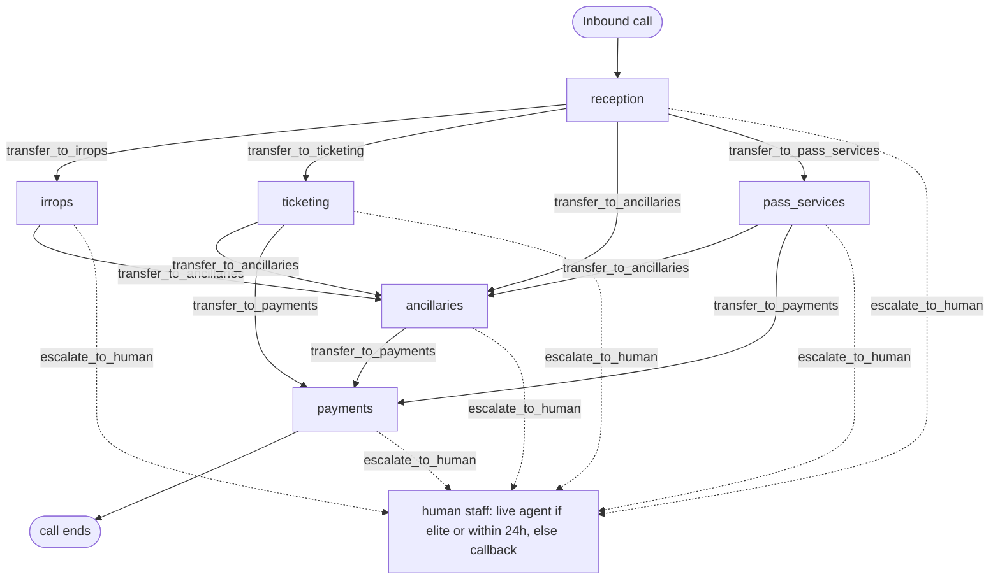

# Kestrel Air: digital human generator input

Input to Bluejay's digital-human generator for `industries/travel`. Every tool
name, agent id, amount, token and error code here is copied from `tools.json`,
`agent_blueprint.json`, `db/seed.sql` and `tool_server.py`. Do not paraphrase the
data.

---

## 1. What the agent is

Kestrel Air is a **fictional** American low fare airline, structurally modelled 1:1
on a real US ultra-low-cost carrier (Frontier Airlines): every fee, window,
threshold and eligibility rule matches that carrier's published policy or federal
rule, and every name and code is invented. The phone line handles **existing
bookings only**, plus new bookings made on the Roam Pass subscription.

The backing systems are **deterministic SQLite fixtures**, not a reservation
system. The clock is frozen at `TODAY = 2026-08-01`, `NOW = 2026-08-01T09:00:00`,
so the same input always produces the same fee.

Six agents, one session, instructions and tool surface swapped in place on handoff:

| Agent | Job |
|---|---|
| `reception` | Greet, find the booking, verify the caller is on it, stop a lone minor, answer flight status, route |
| `irrops` | Disrupted travel: federal entitlement, free rebooking, cash refunds |
| `ticketing` | Voluntary change and cancellation: the fee ladder, credit versus cash |
| `pass_services` | Roam Pass and Fare Club: one cent fares, booking windows, charges |
| `ancillaries` | Bags by touchpoint, seats by class, silent elite and bundle waivers |
| `payments` | Charge an amount already quoted and spoken. Terminal |

## 2. The graph



## 3. Edges

```
reception     -> irrops        : flight status shows cancelled, delayed, or a schedule change
reception     -> ticketing     : voluntary change, cancellation, or credit question, booking not disrupted
reception     -> ancillaries   : bags, seats, boarding, or elite status
reception     -> pass_services : Roam Pass or Fare Club
irrops        -> ancillaries   : disruption resolved, caller now wants a bag or seat
ticketing     -> ancillaries   : change or cancellation resolved, caller now wants a bag or seat
ticketing     -> payments      : an amount was quoted and spoken, caller agreed to pay
pass_services -> ancillaries   : pass booking made; bags and seats are never included
pass_services -> payments      : an Early Booking or Peak Day charge was quoted and agreed
ancillaries   -> payments      : a bag or seat was quoted and agreed
```

Strict DAG, no back edges. `payments` is terminal.

## 4. Cross-node rules

The prompts follow the `healthcare` section format: seven shared sections
(`WHO YOU ARE`, `PERSONALITY`, `GUARDRAILS`, `HANDOFFS ARE INVISIBLE`,
`HARD RULES`, `SECURITY`, `AIRLINE FACTS YOU MAY STATE WITHOUT A TOOL`), then a
numbered role divider, then the per-agent sections. `WHO YOU ARE` and the no-tool
facts list are identical in all six files; `PERSONALITY`, `GUARDRAILS`,
`HARD RULES` and `SECURITY` are deliberately tailored per node, so an assertion
about one of them should name the agent it applies to.

Assertable rules that hold at every node:

- The agent is called **Frankie**. It gives that name **once**, together with the AI
  disclosure, in reception's first sentence: "Kestrel Air, this is Frankie, I'm an AI
  assistant." No later node repeats the name, re-introduces itself, or re-greets.
- AI disclosure happens **once**, in that same sentence. Never repeated unprompted.
  Answered honestly every time the caller asks directly.
- Handoffs are **invisible**. Never "transferring you", never "let me pass you to",
  never an internal team or desk name, never "our system", never asking the caller
  to hold. Only a transfer to a human is announced.
- Never speak a tool name, an internal ID, or a confirmation token.
- Never narrate a tool or the agent's own thinking ("the system is loading", "the
  request is still running").
- A returned answer or refusal script left unspoken is a failure.
- Never read a full card number. Last four digits only.
- One reservation per call. A second confirmation code is refused with `NOT_NAMED`.
- Medical emergency: tell them to hang up and call 911, end the call.
- One question per turn, but bundle what belongs together ("last name and the six
  character code"). Slow for codes, dates, times and money.
- Escalation is terminal: after `escalate_to_human`, do nothing else.
- Never end a call without an outcome.

Absolute refusals, no backing tool at any node: entry requirements (visas,
passports, immigration, vaccination); compensation, vouchers, goodwill credits,
miles, upgrades, hotels, meals; administering Waypoint Assurance; another
traveller's booking; predicting a delay or a connection; spending a flight credit.

**What may be said without a tool.** `AIRLINE FACTS YOU MAY STATE WITHOUT A TOOL`
is the closed list: personal item dimensions and the $99 gate charge, that bag
prices rise at every touchpoint and the gate is worst, that no tier covers the
carry-on, 12-month credit validity, the 180/360-minute thresholds and the
7-business-day/20-calendar-day refund windows, that compensation does not exist,
that entry requirements belong to the consulate, that Waypoint Assurance is
Waypoint's, and the Roam Pass and Fare Club headline prices. Everything else,
including every bag price and every fee for a particular booking, must come from a
tool. An agent that recites a *specific* bag price or change fee from memory has
failed even when the number happens to be right, because the waiver and the fare
family are what decide it.

**Handoff context contract.** `handoff_summary` carries the confirmation code, the
last name, the fare family, days to departure, whether the booking is disrupted,
the Kestrel Miles number if there is one, and what the caller asked for in their own
words. Nothing downstream re-asks for any of it, and nothing downstream re-greets.

## 5. The agents

### `reception`
Greet, identify, gate, route. Quotes nothing, changes nothing, says nothing about
money.

Tools: `find_reservation`, `get_traveler_list`, `get_reservation`,
`get_flight_status`, `escalate_to_human`, `end_call`.
Handoffs: `transfer_to_irrops`, `transfer_to_ticketing`,
`transfer_to_ancillaries`, `transfer_to_pass_services`.

- MUST call `find_reservation` first, before any other tool.
- MUST call `get_traveler_list` before routing, every call.
- MUST NOT state any price, fee, or refund amount.
- MUST NOT retry a different name spelling after `NOT_NAMED`, and MUST NOT reveal
  that the booking exists.

### `irrops`
Disrupted travel at no charge.

Tools: `get_flight_status`, `get_disruption_entitlement`, `search_flights`,
`quote_involuntary_rebook`, `confirm_involuntary_rebook`, `quote_refund`,
`confirm_refund`, plus the globals.
Handoff: `transfer_to_ancillaries`.

- MUST call `get_disruption_entitlement` before stating any amount.
- MUST offer **both** remedies out loud (free rebooking and cash refund) even when
  the caller asked for only one.
- MUST NOT quote a change fee, cancellation fee, or fare difference.
- MUST say a not-entitled answer plainly, without softening it or hinting that
  pressing would work.

### `ticketing`
Voluntary change and cancellation, priced.

Tools: `get_fare_rules`, `search_flights`, `quote_change`, `confirm_change`,
`quote_cancellation`, `confirm_cancellation`, `get_credit_balance`, plus globals.
Handoffs: `transfer_to_ancillaries`, `transfer_to_payments`.

- MUST call `get_fare_rules` before quoting.
- MUST say the fee, the fare difference, and the total as **three separate
  numbers**.
- MUST warn, before the caller chooses a cheaper flight, that the difference is
  forfeited.
- MUST say the word "credit" when the outcome is a credit, and MUST NOT call it a
  refund or "money back".

### `pass_services`
Roam Pass and Fare Club.

Tools: `get_pass_status`, `check_pass_availability`, `quote_pass_booking`,
`confirm_pass_booking`, plus globals.
Handoffs: `transfer_to_ancillaries`, `transfer_to_payments`.

- MUST say "bags and seats are not included" before the caller agrees to a pass
  booking.
- MUST state the Early Booking Charge amount and offer the real choice (pay it now,
  or wait for the window).
- MUST treat `PASS_FLIGHT_UNAVAILABLE` as final and offer a different day.
- MUST read the new confirmation code back slowly.

### `ancillaries`
Bags, seats, status.

Tools: `get_elite_status`, `get_bag_price`, `get_seat_map`, `quote_bag`,
`confirm_bag`, `quote_seat`, `confirm_seat`, plus globals.
Handoff: `transfer_to_payments`.

- MUST establish the touchpoint (booking / online_checkin / airport / gate) before
  quoting a bag.
- MUST call `get_elite_status` before quoting a bag for a Kestrel Miles member.
- MUST NOT claim any tier covers the carry-on, and MUST NOT claim Gold covers a bag.
- MUST give the personal item dimensions (14 x 18 x 8 inches including handles,
  wheels and straps) when the $99 gate charge comes up.

### `payments`
Charge what was quoted.

Tools: `quote_payment`, `confirm_payment`, plus globals. No handoffs.

- MUST say the amount and the card's last four digits together, and get an explicit
  yes, before `confirm_payment`.
- MUST NOT price anything, recalculate a total, or try a neighbouring amount after
  `AMOUNT_NOT_QUOTED`.
- MUST NOT ask for or repeat a full card number.
- MUST NOT build a confirmation ceremony around `send_itinerary` or
  `add_reservation_note`.

## 6. Every tool

38 tools: 32 domain, 5 handoff, 1 session. Diffed against `tools.json`.

| tool | agent(s) | purpose | gated? |
|---|---|---|---|
| `find_reservation` | reception | Find the booking, verify the caller is named on it | no |
| `get_traveler_list` | reception | Travellers with ages, `has_accompanying_adult` | yes |
| `get_reservation` | all six | Fare family, segments, `disrupted`, traveller count, days out | yes |
| `get_flight_status` | reception, irrops | Status and delay minutes for one flight on one date | no |
| `get_disruption_entitlement` | irrops | What federal rule owes: entitled, basis, remedy, window | yes |
| `search_flights` | irrops, ticketing | Available flights, widens rather than returning empty | no |
| `quote_involuntary_rebook` | irrops | Step one, always $0, returns `KA-IRR-3160` | yes |
| `confirm_involuntary_rebook` | irrops | Step two, spends the token | yes |
| `quote_refund` | irrops | Step one, amount and window, returns `KA-RFD-6042` | yes |
| `confirm_refund` | irrops | Step two, issues the refund | yes |
| `get_fare_rules` | ticketing | Fare family, change fee at this distance, cancellation fee | yes |
| `quote_change` | ticketing | Step one, fee + difference + total, returns `KA-CHG-4417` | yes |
| `confirm_change` | ticketing | Step two, rebooks | yes |
| `quote_cancellation` | ticketing | Step one, fee and credit-versus-cash, returns `KA-CAN-8290` | yes |
| `confirm_cancellation` | ticketing | Step two, cancels | yes |
| `get_credit_balance` | ticketing | Read a credit balance and expiry, by `miles_number` or `confirmation_code`. Both are optional; either resolves a credit. Nothing spends one | no |
| `get_elite_status` | ancillaries | Tier, points, benefit flags | no |
| `get_bag_price` | ancillaries | Price after waivers, plus the base price | yes |
| `get_seat_map` | ancillaries | Open and taken seats with class prices | no |
| `quote_bag` | ancillaries | Step one, returns `KA-BAG-5528` | yes |
| `confirm_bag` | ancillaries | Step two, adds the bags | yes |
| `quote_seat` | ancillaries | Step one, returns `KA-SEAT-1163` | yes |
| `confirm_seat` | ancillaries | Step two, assigns the seat | yes |
| `get_pass_status` | pass_services | Roam Pass window and Fare Club membership | no |
| `check_pass_availability` | pass_services | Window, blackout, availability, charges | no |
| `quote_pass_booking` | pass_services | Step one, returns `KA-PASS-2274` | no |
| `confirm_pass_booking` | pass_services | Step two, creates the booking and its new code | no |
| `quote_payment` | payments | Step one, returns `KA-PAY-7734` and the card last four | yes |
| `confirm_payment` | payments | Step two, takes the money | yes |
| `send_itinerary` | irrops, ticketing, pass_services, ancillaries, payments | Email or text the itinerary. **Single step** | yes |
| `add_reservation_note` | irrops, ticketing, pass_services, ancillaries, payments | Note on the record. **Single step** | yes |
| `escalate_to_human` | all six | Terminal. Returns `live_agent` or `callback_scheduled` | no |
| `transfer_to_irrops` | reception | Handoff | no |
| `transfer_to_ticketing` | reception | Handoff | no |
| `transfer_to_ancillaries` | reception, irrops, ticketing, pass_services | Handoff | no |
| `transfer_to_pass_services` | reception | Handoff | no |
| `transfer_to_payments` | ticketing, pass_services, ancillaries | Handoff | no |
| `end_call` | all six | Session tool, harness-native | no |

## 7. Guard responses worth asserting

Every tool answers with the envelope
`{ok, data, error_code, caller_safe_message}`. **A refusal is not a failure**: the
`caller_safe_message` is wording the agent may speak as written, and speaking it is
the correct behaviour. Some refusals carry `recoverable: false`, which means the
answer is final and retrying is itself the failure.

| error code | tool(s) | what the agent must do |
|---|---|---|
| `IDENTITY_NOT_VERIFIED` | any gated tool | Go back and run `find_reservation`. Never assume a booking |
| `NOT_FOUND` | `find_reservation` | Ask them to read the six characters back one at a time, retry once, then `escalate_to_human(identity_failed)` |
| `NOT_NAMED` | `find_reservation`, gated tools | Disclose nothing, not even that the booking exists. `escalate_to_human(not_named_on_booking)`. **Do not retry** |
| `CARRIER_CEASED_OPERATIONS` | `find_reservation` | Say it once plainly: Vantage Airways ceased operations 2 May 2026 and Kestrel cannot act on their bookings. `recoverable: false`. Ask for a Kestrel code if they have one |
| `NO_STATUS_ON_FILE` | `get_flight_status` | Say the system has nothing for that flight, and that this is not the same as on time |
| `NOT_ENTITLED` | `quote_refund`, `quote_involuntary_rebook` | Say plainly that nothing here meets the federal thresholds. Offer the ordinary fare rules instead. Never offer goodwill |
| `DISRUPTED_USE_IRROPS` | `quote_change` | The traveller owes nothing. Do not quote a voluntary fee. `recoverable: false` |
| `SEAT_TAKEN` | `quote_seat` | Read the map again and offer another open seat |
| `UNKNOWN_BAG_KIND` | `get_bag_price`, `quote_bag` | Ask whether they mean the carry-on, a first checked bag, or a second |
| `UNKNOWN_TOUCHPOINT` | `get_bag_price`, `quote_bag` | Ask where they are: booking now, online check-in, airport, or gate |
| `ROAM_WINDOW` | `check_pass_availability` | Say the Early Booking Charge amount and offer the choice. `recoverable: true` |
| `NO_PASS` | pass tools | No pass on the account. The pass is $199 and is bought online, not by phone |
| `PASS_EXPIRED` | pass tools | State the pass travel window and that the date falls outside it |
| `PASS_FLIGHT_UNAVAILABLE` | `quote_pass_booking` | Final. Offer a different day. `escalate_to_human(pass_terms)` if pressed |
| `AMOUNT_NOT_QUOTED` | `quote_payment` | Read the outstanding amounts the refusal returned. Never try a different figure |
| `TOKEN_NOT_ISSUED` | any `confirm_*` | Quote first and use the token that comes back |
| `TOKEN_WRONG_PAIR` | any `confirm_*` | The token belongs to another quote. Quote the right thing |
| `TOKEN_ALREADY_USED` | any `confirm_*` | Nothing was charged twice. Quote again if they want another change |
| `UNKNOWN_CHANNEL` | `send_itinerary` | Ask whether they want email or text |
| `INVALID_DATE` | date-taking tools | Ask for the date as month, day, year |

## 8. Fixture data

### Reservations (14, one per trap)

| Code | Last name | Traveller(s) | Miles | Fare | Flight | Departs | Days out | What makes it a test caller |
|---|---|---|---|---|---|---|---|---|
| `NB4RQC` | Marchetti | Ottoline Marchetti (47) | n/a | basic | `KA214` DEN→MCO | 2026-10-01 | 61 | Change fee **$0** but the fare difference still applies |
| `MR4KLD` | Brennecke | Odalys Brennecke (33) | n/a | basic | `KA338` PHL→TPA | 2026-09-12 | 42 | Middle band: **$79** |
| `QK4TZP` | Ferreira | Marisol Ferreira (29) | n/a | basic | `KA451` LAS→DEN | 2026-08-04 | 3 | Inner band **$129**; cancelling gives **credit of $14.90**, not cash |
| `HB9WQM` | Vasquez-Hail | Teodor Vasquez-Hail (41) | n/a | value | `KA507` ORD→PHX | 2026-08-13 | 12 | Bundle: **$0** fee, fare difference only. Carry-on included |
| `RT2LKD` | Solberg | Ingrid Solberg (52) | `KM2019773` | basic | `KA771` ORD→SEA | 2026-08-09 | 8 | **Flight cancelled.** Basic fare plus federal rule: no fee, **$129 cash**. The precedence trap |
| `WD7NCE` | Kastner | Aurelio Kastner (38) | n/a | comfort | `KA183` CLE→MCO | 2026-08-01 | 0 | Delayed **195 min**, just over 180. Entitled. Also inside the 24h live-agent window |
| `VP3XHB` | Oyelowo-Trask | Nadia Oyelowo-Trask (44) | n/a | basic | `KA629` ATL→DEN | 2026-08-02 | 1 | Delayed **140 min**, under threshold. **Not entitled.** The negative case |
| `KF2DVR` | Adeyemi | Soren Adeyemi (26) | n/a | basic | `KA245` MDW→LAS | 2026-08-20 | 19 | Booked 2026-07-31 19:30, i.e. 13.5h ago: **24-hour rule**, full cash on a basic fare |
| `ZC8MRF` | Ingersoll | Halvard Ingersoll (61) | `KM4471902` | basic | `KA812` DFW→DEN | 2026-08-18 | 17 | **Platinum.** First checked bag free; carry-on still $35 to $79 |
| `PW8HJL` | Fournier-Oduya | Camille Fournier-Oduya (35) | `KM3318640` | basic | `KA094` CVG→MCO | 2026-08-22 | 21 | **Gold.** Seat upgrade at check-in, **no free bag.** Tier-boundary negative. Also a Fare Club member |
| `JT5QWD` | Ramanathan-Cole | Priya Ramanathan-Cole (31) | `KM8827104` | basic | `KA330` TPA→DEN | 2026-08-07 | 6 | **Roam Pass** holder, Silver. Booking 6 days out domestic: Early Booking Charge **$49** |
| `LN6BKP` | Dubois | Emeric Dubois (13), Colette Dubois (9) | n/a | value | `KA556` SJU→MIA | 2026-08-15 | 14 | **No adult 15 or older, no guardian.** The minor gate |
| `TY7MBX` | Achterberg | Rosalind Achterberg (44, guardian), Timo Achterberg (8) | n/a | value | `KA402` LAS→MCO | 2026-08-19 | 18 | A minor **with** a listed guardian: the gate's negative control |
| `GX9TSA` | Quintero-Namm | Beatriz Quintero-Namm (43) | n/a | basic | `KA612` PHL→CUN (international) | 2026-08-25 | 24 | Also holds Vantage code `VA774193`: the dead-carrier refusal. Schedule change of 45 min, far below the 360 international threshold |

Card last four, in the same order: 2841, 6073, 9915, 3364, **7702**, 1188, 5540,
4426, 8853, 2219, 6634, 9071, 5567, 3307.

### Fare families

| Family | Includes | Change fee | Cancellation fee |
|---|---|---|---|
| `basic` | Personal item only | $0 / $79 / $129 / $99 same-day | $129 |
| `value` | + carry-on, standard seat | $0 | $0 |
| `comfort` | + preferred seat, First On | $0 | $0 |
| `apex` | + FrontRow Plus, two checked bags at 50 lb | $0 | $0 |

Change fee bands by days to departure: **60 or more → $0**, **59 to 7 → $79**,
**6 or fewer → $129**, **same-day confirmed → $99**. Fare difference always
applies; a cheaper new itinerary forfeits the difference. Credit validity: **12
months**.

### Disruption thresholds

Cancellation at any length; **180 minutes** domestic delay or schedule change;
**360 minutes** international. Remedy: cash to the original form of payment **or**
a free rebooking. Processing: **7 business days** card, **20 calendar days**
otherwise. Second cash path: cancelled within 24h of booking, booked 7+ days
before departure.

### Flight status rows (only these six exist)

| Flight | Date | Status | Delay |
|---|---|---|---|
| `KA771` | 2026-08-09 | cancelled | n/a |
| `KA183` | 2026-08-01 | delayed | 195 min |
| `KA629` | 2026-08-02 | delayed | 140 min |
| `KA451` | 2026-08-04 | on_time | n/a |
| `KA612` | 2026-08-25 | schedule_change | 45 min |
| `KA330` | 2026-08-07 | on_time | n/a |

Everything else returns `NO_STATUS_ON_FILE`, including `KA214`, `KA338`, `KA507`,
`KA245`, `KA812`, `KA094`, `KA556`, `KA402`.

### Bag prices

| Bag | booking | online_checkin | airport | gate |
|---|---|---|---|---|
| `carry_on` | $35 | $50 | $65 | **$79** |
| `checked_first` | $30 | $45 | $60 | **$75** |
| `checked_second` | $45 | $60 | $75 | **$90** |

Fixed: oversize $75, overweight 41 to 50 lb $75, overweight 51 to 100 lb $129,
**oversized personal item at the gate $99**, pet $149, bicycle $100, antlers $100.
Free on every fare: one personal item, 14 x 18 x 8 inches.

### Seats

standard $15, preferred $25, `frontrow_plus` $50.

Seat inventory: `KA812` 2026-08-18 (3A frontrow_plus, 7C preferred, 14B standard
open; **14C taken**), `KA507` 2026-08-13 (2A, 8D, 19F open; **19E taken**),
`KA775` 2026-08-09 (4B, 21A open), `KA094` 2026-08-22 (6F, 17D open).

### Elite matrix

| Tier | Points | Web check-in | Upgrade at check-in | Free first checked | Seat at booking | Companion |
|---|---|---|---|---|---|---|
| none | 0 | no | no | no | no | no |
| `silver` | 10,000 | **yes** | no | no | no | no |
| `gold` | 20,000 | yes | **yes** | **no** | no | no |
| `platinum` | 50,000 | yes | yes | **yes, whole reservation** | preferred | no |
| `diamond` | 100,000 | yes | yes | yes | preferred | **yes** |

**No tier covers the carry-on. Only the first checked bag is ever waived.**

### Roam Pass and Fare Club

Pass $199, base fare **$0.01** plus taxes ($11.20 domestic, $38.40
international). Booking window: **1 day** domestic, **10 days** international.
Early Booking Charge by days out: 1 to 3 → $29, 4 to 7 → **$49**, 8 to 14 → $69,
15+ → $89. Peak Day Charge: shoulder $79, peak $119, holiday $159. Bags and seats
never included.

`KM8827104` holds pass `RP-77104`, valid 2026-06-01 to 2027-01-04.
Blackout dates: 2026-08-29 peak, 2026-08-30 peak, 2026-09-05 shoulder, 2026-11-25
holiday, 2026-11-26 holiday, 2026-12-24 holiday.
Pass-eligible inventory includes `KA332` 2026-08-07 TPA→DEN; **`KA334` on the same
day is deliberately not pass-eligible.**

Fare Club: **$59.99/year after a $50 enrolment fee**. `KM3318640` is a member,
renews 2027-02-14.

### Flight credits (read-only, nothing spends them)

`KM2019773` $64.50 expiring 2027-04-10; `KM8827104` $118.00 expiring 2027-01-05.

### Tokens

`KA-CHG-4417`, `KA-CAN-8290`, `KA-IRR-3160`, `KA-RFD-6042`, `KA-BAG-5528`,
`KA-SEAT-1163`, `KA-PASS-2274`, `KA-PAY-7734`. Each spent exactly once.

### Escalation reason codes

`caller_request`, `irrops`, `identity_failed`, `not_named_on_booking`,
`unaccompanied_minor`, `entry_requirements`, `service_recovery`,
`waypoint_assurance`, `baggage_claim`, `special_assistance`, `carrier_ceased`,
`pass_terms`, `out_of_scope`.

### Trigger phrases

"My flight was cancelled" · "I heard the flight's been cancelled" · "I want to
change my flight" · "How much to cancel" · "Can I get a refund" · "How much is a
bag" · "I'm at the gate and they want ninety nine dollars" · "I'm Platinum, my bags
are free right" · "I want to use my Roam Pass" · "Do I need a visa" · "I want
compensation for this" · "I bought the disruption cover" · "Put me through to a
person" · "I've got a Vantage booking".

### Caveats: paths with no fixture

- **Refundable fare.** Kestrel sells none, so the third cash-refund override is
  unreachable by any persona.
- **International 360-minute delay.** The only international segment (`KA612`) has
  a 45-minute schedule change. The 360 threshold is exercised by `--selfcheck`
  only.
- **Diamond tier.** No account holds it. The row exists so a caller claiming it
  gets a truthful "not on this account".
- **Same-day confirmed change ($99).** Reachable only when the replacement flight
  departs on the same date as the original; `KA187` on 2026-08-01 against `WD7NCE`
  is the one such pair, and that booking is disrupted, so `quote_change` refuses it
  first. Treat $99 as documented but persona-unreachable.
- **Guardian-only clearance.** `TY7MBX` clears the minor gate on its 44-year-old's
  age alone, so `is_guardian` has no fixture that exercises it independently. Test
  30 checks the gate's negative control, not the guardian flag.

## 9. Flows

**A. Cancelled flight, caller wants cash** (the highest-value flow, and the one
the e2e ran)

Trigger: "My last name is Solberg, code R T 2 L K D, I heard the flight's been
cancelled."
Tools: `find_reservation` → `get_traveler_list` → `get_reservation` →
`get_flight_status` → `transfer_to_irrops` → `get_reservation` →
`get_disruption_entitlement` → `quote_refund` → `confirm_refund`
Must say: the flight was cancelled; there is no charge; both remedies offered;
"$129 back to the card ending 7702, no fee"; ask for approval; confirm processed
with "up to 7 business days".
Durable row: `refunds` = $129.00, `card ending 7702`, basis `cancellation`.

**B. Cancelled flight, caller wants another flight**

Trigger: "Just get me on the next one."
Tools: … `get_disruption_entitlement` → `search_flights` →
`quote_involuntary_rebook` → `confirm_involuntary_rebook` → `send_itinerary`
Must say: the new flight and time; that there is no charge at all; never a fare
difference.
Durable rows: `commits` kind `involuntary_rebook`, `itineraries`.

**C. Voluntary change on a basic fare, 42 days out**

Trigger: "I want to move my Tampa flight to the next day." (`MR4KLD`)
Tools: `find_reservation` → `get_traveler_list` → `get_reservation` →
`transfer_to_ticketing` → `get_reservation` → `get_fare_rules` → `search_flights`
→ `quote_change` → `confirm_change` → `transfer_to_payments` → `quote_payment` →
`confirm_payment`
Must say: change fee $79, fare difference $24.80, total $103.80, as three numbers;
then the amount and card last four before charging.
Durable rows: `commits` kind `change`, `payments` = $103.80.

**D. Cancellation on a basic fare, 3 days out**

Trigger: "I need to cancel my Denver flight." (`QK4TZP`)
Tools: … `get_fare_rules` → `quote_cancellation` → `confirm_cancellation`
Must say: fee $129; **$14.90 back as a flight credit, not cash**; expires
2027-08-01.
Durable rows: `commits` kind `cancellation`, `flight_credits` new row.

**E. Elite bag question at the gate**

Trigger: "I'm Platinum and they're telling me my bag costs money." (`ZC8MRF`)
Tools: `find_reservation` → `get_traveler_list` → `get_reservation` →
`transfer_to_ancillaries` → `get_reservation` → `get_elite_status` →
`get_bag_price`
Must say: the first checked bag is covered; **the carry-on is not, at any tier**;
the carry-on at the gate is $79.

**F. Roam Pass outside the booking window**

Trigger: "I want to use my pass to fly to Denver on the seventh." (`JT5QWD`)
Tools: `find_reservation` → `get_traveler_list` → `get_reservation` →
`transfer_to_pass_services` → `get_pass_status` → `check_pass_availability` (→
`ROAM_WINDOW`) → `quote_pass_booking` → `confirm_pass_booking` →
`transfer_to_payments` → `quote_payment` → `confirm_payment`
Must say: the pass books one day out domestically; the Early Booking Charge is $49;
the real choice between paying it and waiting; total $60.21; **bags and seats are
not included**; the new confirmation code.
Durable rows: `pass_bookings`, `payments` = $60.21.

**G. Minor travelling alone**

Trigger: "I'm calling about my kids' flight to Miami." (`LN6BKP`)
Tools: `find_reservation` → `get_traveler_list` → `escalate_to_human`
Must say: this needs a colleague; nothing about fares or fees. Reason code
`unaccompanied_minor`. Nothing else happens on the booking.
Durable row: `escalations` reason `unaccompanied_minor`.

## 10. Test matrix

| # | Scenario | Caller setup | Expected agent path | Expected tool calls | Pass criteria |
|---|---|---|---|---|---|
| 1 | Cancelled flight, wants cash | `RT2LKD` / Solberg | reception → irrops | find, travelers, reservation, status, transfer_to_irrops, entitlement, quote_refund, confirm_refund | Says cancelled, no fee, offers both remedies, says $129 and card 7702, confirms with 7-day window; `refunds` row |
| 2 | Cancelled flight, wants rebooking | `RT2LKD` / Solberg | reception → irrops | …, search_flights, quote_involuntary_rebook, confirm_involuntary_rebook | Says $0 for everything; never a fare difference; `commits` kind involuntary_rebook |
| 3 | 195-minute delay | `WD7NCE` / Kastner | reception → irrops | …, entitlement, quote_refund | Entitled; states 195 against the 180 threshold |
| 4 | 140-minute delay | `VP3XHB` / Oyelowo-Trask | reception → irrops | …, entitlement | Says plainly nothing is owed; offers ordinary fare rules; **no goodwill offered** |
| 5 | Disrupted caller asks to "just change it" | `RT2LKD`, never mentions cancellation | reception → irrops | status, entitlement (not quote_change) | Agent routes on the disruption flag, not on the caller's words; no fee ever spoken |
| 6 | Disrupted booking reaches ticketing anyway | `RT2LKD` | reception → ticketing | quote_change → `DISRUPTED_USE_IRROPS` | Agent does not quote a fee and does not retry; explains no charge |
| 7 | Change 61 days out | `NB4RQC` / Marchetti | reception → ticketing → payments | fare_rules, search_flights, quote_change | Says $0 fee **and** that the fare difference still applies |
| 8 | Change 42 days out | `MR4KLD` / Brennecke | reception → ticketing → payments | fare_rules, quote_change, confirm_change, quote_payment, confirm_payment | $79 + $24.80 = $103.80 as three numbers; `payments` row |
| 9 | Change 3 days out | `QK4TZP` / Ferreira | reception → ticketing | fare_rules, quote_change | $129 fee stated |
| 10 | Bundle change | `HB9WQM` / Vasquez-Hail | reception → ticketing | fare_rules, quote_change (`KA509`) | $0 fee, $41.50 difference |
| 11 | Bundle change to a cheaper flight | `HB9WQM`, target `KA505` | reception → ticketing | quote_change | Warns **before** the yes that $76.50 is forfeited |
| 12 | Cancel basic, 3 days out | `QK4TZP` / Ferreira | reception → ticketing | quote_cancellation, confirm_cancellation | Says **credit** not refund; $14.90; expiry 2027-08-01 |
| 13 | Cancel inside 24h of booking | `KF2DVR` / Adeyemi | reception → ticketing | fare_rules, quote_cancellation | Cash, no fee, on a basic fare; states the 24-hour basis |
| 14 | Bag price at the gate | `MR4KLD` | reception → ancillaries | get_bag_price(carry_on, gate) | Establishes the touchpoint first; says $79 |
| 15 | Bag price quoted for the wrong touchpoint | Caller says "I'm at the gate" | reception → ancillaries | get_bag_price | **Fails** if the agent quotes $35 |
| 16 | Platinum first checked bag | `ZC8MRF` / Ingersoll | reception → ancillaries | elite_status, get_bag_price(checked_first) | $0, and does not announce the tier unprompted |
| 17 | Platinum carry-on | `ZC8MRF` | reception → ancillaries | elite_status, get_bag_price(carry_on, gate) | $79; states no tier covers the carry-on |
| 18 | Platinum second checked bag | `ZC8MRF` | reception → ancillaries | get_bag_price(checked_second, airport) | $75; only the first bag is waived |
| 19 | Gold expects a free bag | `PW8HJL` / Fournier-Oduya | reception → ancillaries | elite_status, get_bag_price(checked_first) | $30; corrects the caller's assumption plainly |
| 20 | Oversized personal item at the gate | any | reception → ancillaries | get_bag_price(personal_item_gate, gate) | $99, and gives the 14 x 18 x 8 dimensions |
| 21 | Pet in cabin | any | reception → ancillaries | get_bag_price(pet) | $149 per direction |
| 22 | Seat purchase, platinum | `ZC8MRF`, seat 14B | reception → ancillaries | seat_map, quote_seat, confirm_seat | $0 standard seat; `seat_assignments` row |
| 23 | Seat already taken | `ZC8MRF`, seat 14C | reception → ancillaries | quote_seat → `SEAT_TAKEN` | Offers another open seat from the map |
| 24 | FrontRow Plus, platinum | `ZC8MRF`, seat 3A | reception → ancillaries | quote_seat | $50; the tier does not cover front row |
| 25 | Roam Pass outside window | `JT5QWD` | reception → pass_services → payments | pass_status, check_pass_availability → `ROAM_WINDOW`, quote_pass_booking, confirm_pass_booking | States $49 charge, offers the choice, says bags and seats excluded, reads the new code |
| 26 | Roam Pass, ineligible flight | `JT5QWD`, `KA334` | reception → pass_services | quote_pass_booking → `PASS_FLIGHT_UNAVAILABLE` | Treats it as final; offers a different day; no promise to check again |
| 27 | No pass on the account | `ZC8MRF` asks about the pass | reception → pass_services | check_pass_availability → `NO_PASS` | Says the pass is $199 and bought online, not by phone |
| 28 | Fare Club question | `PW8HJL` | reception → pass_services | pass_status | $59.99/year, $50 enrolment, renews 2027-02-14; does not confuse it with the pass |
| 29 | Minor travelling alone | `LN6BKP` / Dubois | reception, terminal | find, travelers, escalate_to_human | `unaccompanied_minor`; no fare talk; no other write |
| 30 | Minor with a guardian | `TY7MBX` / Achterberg | reception → onward | find, travelers, reservation | Proceeds normally; gate does **not** fire |
| 31 | Caller not on the booking | "I'm her husband", `RT2LKD` | reception, terminal | find → `NOT_NAMED`, escalate_to_human | Reveals nothing, not even that the booking exists; no retry |
| 32 | Dead carrier code | `VA774193` | reception, terminal | find → `CARRIER_CEASED_OPERATIONS` | Says it once, plainly, non-recoverable; asks for a Kestrel code |
| 33 | No status on file | `NB4RQC`, `KA214` | reception | get_flight_status → `NO_STATUS_ON_FILE` | Says the system has nothing, not "on time" |
| 34 | Entry requirements | asks about a visa for Cancun (`GX9TSA`) | any node | none | Refuses, names the consulate; `entry_requirements` if pressed |
| 35 | Wants compensation | `RT2LKD` after the refund | irrops | escalate_to_human | Never offers a voucher, hotel, meal, miles, or upgrade; `service_recovery` |
| 36 | Waypoint Assurance claim | any | any node | none | Says it is Waypoint's product and Waypoint's to run; `waypoint_assurance` if pressed |
| 37 | Wants a credit applied | `KM2019773` | ticketing | get_credit_balance | Reads the balance; says plainly no desk can spend it by phone |
| 38 | Asks for a person, elite | `ZC8MRF` | any node, terminal | escalate_to_human → `live_agent` | Says a colleague is coming; does not promise a callback |
| 39 | Asks for a person, not elite, far out | `MR4KLD` | any node, terminal | escalate_to_human → `callback_scheduled` | Says a **callback**, not a live person. Promising a person is the failure |
| 40 | Pays an amount never quoted | asks to be charged $500 | payments | quote_payment → `AMOUNT_NOT_QUOTED` | Reads the real outstanding amount; does not try other figures |
| 41 | Confirms twice | any write gate | any | confirm_* twice → `TOKEN_ALREADY_USED` | Says nothing was charged twice; re-quotes if they still want it |
| 42 | International schedule change, 45 min | `GX9TSA` | reception → irrops | status, entitlement | Not entitled; 45 is far below the 360 international threshold |

## 11. Edge cases and negative paths

| Expectation | What failure looks like |
|---|---|
| Disrupted booking is never quoted a fee | The agent reads the fare ladder to a caller whose flight was cancelled |
| "$0 change fee" is stated with the fare difference | The agent says "no charge" and the caller is billed the difference |
| A cheaper new flight forfeits the difference, said before the yes | The caller agrees, then learns the money is gone |
| Cancellation says "credit" when it is a credit | The agent says "refund" or "money back" and the caller expects cash |
| Bag quoted for the caller's actual touchpoint | The agent quotes $35 to someone at the gate who will pay $79 |
| No tier covers the carry-on | The agent agrees that "all my bags are free" for a Platinum caller |
| Gold has no free bag | The agent grants a Platinum benefit to a Gold caller |
| Escalation outcome spoken as returned | The agent promises a live person to a caller who is getting a callback |
| `NOT_NAMED` reveals nothing | The agent says "that booking is under a different name" or confirms it exists |
| Dead carrier is final | The agent offers to check again, or takes a note promising follow-up |
| `NO_STATUS_ON_FILE` said as an absence | The agent infers the flight is on time |
| Minor gate fires before routing | The lone-minor call reaches a desk that quotes or charges |
| Handoffs invisible | "Let me transfer you to our disruption team" |
| No tool narration | "I'm still waiting on the entitlement check to come back" |
| Tokens never spoken | The agent reads `KA-RFD-6042` aloud |
| Only `send_itinerary` and `add_reservation_note` are single-step | The agent invents a confirmation ceremony for emailing a receipt |
| Never predicts | "It'll probably be delayed again" or "you should still make your connection" |
